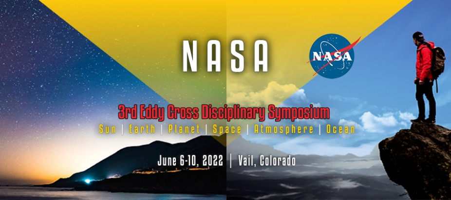

# Reflections on the Jack Eddy Symposium

2i2c supported and participated in the [3rd Eddy Cross Disciplinary Symposium](https://cpaess.ucar.edu/meetings/eddy-symposium-2022) held recently in Vail Colorado. The event was hosted by the Cooperative Programs for the Advancement of Earth System Science ([CPAESS](https://cpaess.ucar.edu/)) team at the University Corporation for Atmospheric Research ([UCAR](https://www.ucar.edu/)) with support from NASA.

## Context

The Symposium was framed by the interesting and interdisciplinary scientific career of the late [Jack Eddy](https://en.wikipedia.org/wiki/John_A._Eddy). Eddy's legacy was highlighted and his influence has been extended by dynamic leadership from NASA Program Officer [Madhulika Guhathakurta (Lika)](https://science.nasa.gov/about-us/organization-and-leadership/lead-program-scientist-for-lws). Lika helped launch and has sustained NASA's [Living with a Star (LWS)](https://science.nasa.gov/heliophysics/programs/living-with-a-star) program over the past two decades. Prior to LWS, NASA had a variety of siloed efforts focused on near-Sun and near-Earth behavior. The LWS program led to an integration of these efforts under "system science" or "systems engineering" approaches and an expressed desired to connect LWS research activities with impacts on Earth (society, biology, culture, etc.). The program has expanded to include explorations of similar questions arising around other planets in our solar system and the recently discovered collection of exoplanets. Scientists from diverse disciplines (plasma physics, stellar evolution, atmospheric chemistry, space weather, planetary science,...) work together on "cross disciplinary" research that helps us understand our lives near our star.

The Symposium focused on three disciplinary areas (**Exoplanets**; **Sun-Climate and Star-Climate interactions**; **Risk and resilience of space weather**) unified under the cross-cutting thread of **open science**. Frequent references were made to the upcoming 2023 Year of Open Science and [NASA's Transform to Open Science (TOPS) mission](https://science.nasa.gov/open-science/transform-to-open-science). Symposium attendees listened to talks surveying the four areas in the morning and participated in hackathon-style breakout projects during the afternoons. Work on the projects launched at the Eddy Symposium [continues](https://github.com/jack-eddy-symposium)...

## 2i2c's role

2i2c, with input from Symposium CoChair's [Dan Marsh](https://staff.ucar.edu/users/marsh) and [Ryan McGranaghan](http://www.ryanmcgranaghan.com/about.html), rapidly deployed a cloud-hosted JupyterHub for use during the event. The work to set up that hub, openly chronicled in [this GitHub issue](https://github.com/2i2c-org/infrastructure/issues/1329), included swapping out a Pangeo-style software environment for a heliophysics-specific resource developed by [HelioCloud](http://heliocloud.org/) with special thanks to [Brian Thomas](https://www.nasa.gov/offices/oce/bios/mwm/Thomas-Brian-bio.html)!

2i2c CoFounder Fernando Pérez gave a talk on how he is ["living la vida nube"](https://docs.google.com/presentation/d/1i99eQqOVCSQyxoyscUo0dl3Ybgdex5qKo_KEO9YGxQg/edit?usp=drivesdk) . Fernando described the ways he, research collaborators, and students are using the Jupyter ecosystem. Diverse and curated tools in Jupyter hubs for the [Jupyter Meets the Earth Project](https://jupytearth.org/) and [Berkeley's data science programs](https://data.berkeley.edu/) were highlighted. The talk showcased how these tools have been integrated to support individuals and communities of practice in data-driven research. In response to requests from the organizers and participants, Fernando gave a demonstration on how to use the hub 2i2c set up for the Symposium and an introduction to version control using `git`.

2i2c CoFounder Jim Colliander gave a talk titled [Governing the Science Commons](https://bit.ly/eddy-science-commons). Three key points from Jim's talk were: the virtue that should guide the improvements to the scientific enterprise is intellectual generosity; implementation of intellectual generosity into science requires commons-based governance; the convergence of open source tools that support data-intensive collaborative research and learning (as showcased by Fernando) and agency interest ([NASA TOPS](https://science.nasa.gov/open-science/transform-to-open-science), [UNESCO](https://unesdoc.unesco.org/ark:/48223/pf0000379949/PDF/379949eng.pdf.multi.page=1)) in open science is an inflection point for global change.

## Things we learned

Our experience with the Symposium taught 2i2c a few things. 

We learned that our engineering team can rapidly deploy interactive computing resources to support a research and education community. Along the way, we confirmed what we've been learning from Pangeo and the neuroscience communities: flexible methods to customize the software environment are necessary. We confirmed that our developing shared responsibility model, enabling domain-specific experts to provide curated toolchains for their communities while leveraging 2i2c's infrastructure expertise, is the right approach.

Access to the interactive computing platform was granted to any member of the [Symposium's GitHub organization](https://github.com/jack-eddy-symposium/). While this works, we learned that it involves some toil since organizers had to work through the GitHub invitation process for each participant. We are exploring others ways to systematically grant event participants access to a hub.

The Eddy Symposium experience reminded us that some skill at using `git` is vital for collaboration. Fernando's brief introduction to `git` provided [the mental model of working on a directed acyclyic graph](https://jack-eddy-symposium.github.io/intro-git-jupyter/intro-git/git-visuals.html). Roving support from Jim and Fernando during the afternoon hackathon sessions normalized the skill level across the groups but not without a few merge conflicts and frustration. Near the beginning of future workshops, we will follow an improved approach aimed at stablishing good `git` hygeine and familiarity with the collaboration workflow using a simple pull request.
