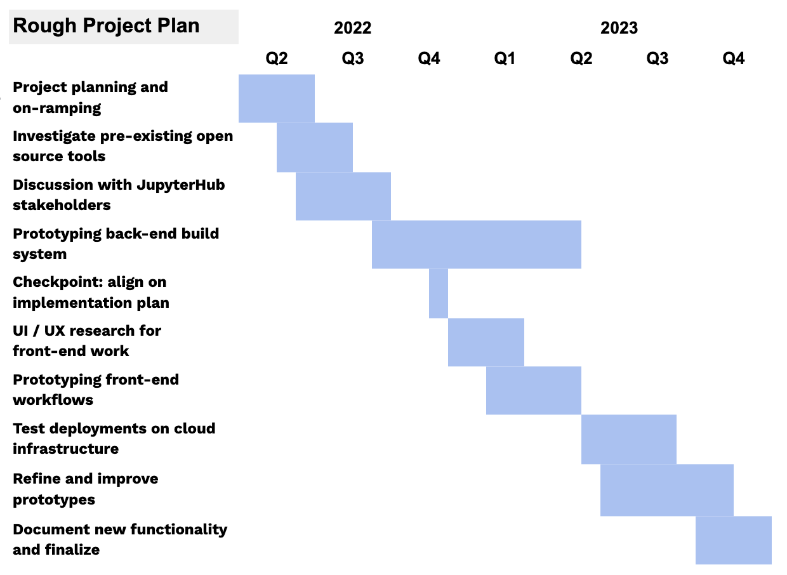

# Introduction

[Mybinder.org](mybinder.org) enables researchers across the world to replicate computational environments in the cloud. It allows researchers to turn static code into interactive literate coding environments with a click of a button within seconds. The [mybinder.org](mybinder.org) service is powered by [BinderHub](binderhub.readthedocs.io), an open-source tool developed by [the Jupyter Project](jupyter.org) that many organizations have deployed for their own communities. It does this by _dynamically building _the software environment needed to reproduce a computation (using a tool called [repo2docker](repo2docker.readthedocs.io)), and making this environment available to users.

BinderHub was developed for use-cases that are _temporary_ and _fully open _by design. BinderHub sessions are destroyed after a fixed amount of time and there is no persistent storage or authentication. However, many research institutions also need more “standard” service features like authentication and persistent storage.

Over the past several years, the [GESIS Notebooks](http://notebooks.gesis.org) team made the first steps towards bridging this gap through their [Persistent BinderHub](https://github.com/gesiscss/persistent_binderhub) implementation. This was a modified and authenticated BinderHub that _included_ persistent storage across sessions. The Persistent BinderHub service was very successful at GESIS and with its partner communities, and the team wishes to build this functionality into the JupyterHub community’s core technology so that these features can be enjoyed for more use-cases and by many communities.

To enable this vision, we have partnered with GESIS in cooperation with [NFDI4DS](https://www.nfdi4datascience.de/), [CESSDA](https://www.cessda.eu/), and members of the [JMTE](https://jupytearth.org/) project. This collaboration has three primary goals:

* **Generalize the Persistent BinderHub functionality/experience to run on cloud-agnostic infrastructure**, so that other stakeholders in NFDI, CESSDA, and the broader scientific community may benefit from this functionality and experience.
* **Upstream this functionality by making contributions into Jupyter community projects**, so that it will be maintained and improved by a community moving forward, thus improving its reliability and sustainability.
* **Improve the implementation and user experience around Persistent BinderHub**, in order to make it more reliable, scalable, productive, and enjoyable to use.

We began this collaboration several months ago, and have focused our efforts on exploring potential implementation pathways for this functionality. We believe that we now have a path forward for this functionality, and this blog post is a brief report of our efforts and future plans as we undertake this effort. See [this GitHub Projects Board for issues that implement this effort](https://github.com/orgs/2i2c-org/projects/33).

### Exploration 1: Adding persistent storage directly into BinderHub

Our initial intention was to incorporate persistent storage and authentication from the GESIS  Persistent BinderHub into the [BinderHub codebase](http://binderhub.readthedocs.io/). We began by holding a series of meetings to discuss technical requirements from our experience in the JupyterHub/BinderHub ecosystem, and also conducted an audit of the [Persistent BinderHub codebase](https://www.google.com/url?q=https://github.com/gesiscss/persistent_binderhub/blob/9936fc2251abafd00921b3b53954fb60c8640347/persistent_binderhub/values.yaml). The Persistent BinderHub implementation is a [modified Helm Chart](https://github.com/gesiscss/persistent_binderhub/blob/9936fc2251abafd00921b3b53954fb60c8640347/persistent_binderhub/values.yaml) that configures a JupyterHub to expose its authentication and persistent storage functionality, overriding the BinderHub default behavior. We were concerned that building this functionality _natively_ into BinderHub would be challenging given that the BinderHub codebase was designed for ephemeral user sessions.

So, we decided to take another approach:

### Exploration 2: Add dynamic image building to JupyterHub

We realized that there is a way to make this functionality more broadly useful and more maintainable, while still achieving the end-user experience that the GESIS team needed. Instead of modifying BinderHub to incorporate JupyterHub’s storage and authentication features, **we would give JupyterHub the ability do dynamically generate user environments using [repo2docker](http://repo2docker.readthedocs.io/)**.

This would give JupyterHub users more flexibility over the environments served by their hub, and expose Binder-style workflows to the “typical” JupyterHub workflow. BinderHub could then be simplified to re-use JupyterHub’s image building functionality as a part of its own service. We also identified a prototype of this functionality in the [tljh-repo2docker](https://github.com/plasmabio/tljh-repo2docker) project that [QuantStack](https://quantstack.net/) had built for the [PlasmaBio project](https://plasmabio.org/). This implementation was seen as successful, and something others in the community had wanted to generalize for some time.

# Our implementation plan

## Two phases of implementation

With this alternative implementation route in place, we identified two major steps to accomplish this project:

1. **Build a back-end for dynamic environment building**. JupyterHub needs to understand how to call repo2docker’s image generation from a Docker-based environment. It needs to expose this ability via APIs that others can build interfaces on top of.
2. **Build a front-end that is user-friendly and accessible. **Once the back-end is functional, we must build a front-end experience that feels familiar to BinderHub users and is easy and intuitive to use.

Here are a few tasks that we’re carrying out next to make progress on the above two items.

* Build a working prototype for image generation via a _JupyterHub Service_ (see below for current status)
* Research the `tljh-repo2docker` code base to understand how we could build upon its UX and functionality.
* Understand the typical process that GESIS and NFDI users follow in their BinderHub workflows, to ensure that it can be replicated via this new implementation.
* Perform UI/UX research validation to inform the implementation from a user’s perspective.

As a follow-up, we’ll likely re-work the BinderHub codebase to utilize JupyterHub’s new repo2docker service, rather than defining its own custom repo2docker functionality.

## Back-end implementation as a JupyterHub Service

We’re planning to use [JupyterHub Services](https://jupyterhub.readthedocs.io/en/stable/reference/services.html) to add the back-end functionality for dynamic image building to a JupyterHub. Services are a way to expose functionality via a JupyterHub REST API, and would allow us to expose basic image generation on-the-fly with [repo2docker](https://repo2docker.readthedocs.io/). We aim for basic functionality to be as close as possible to repo2docker’s default behavior, but to make this functionality _composable and customizable _if a JupyterHub administrator wants to provide different out-of-the-box functionality.

While details may still change, we believe that the major architectural plan has now been settled. We have [an experimental codebase](https://github.com/consideratio/repo2docker-service) with a basic implementation of the repo2docker service described above. As part of this effort, this team has also made a number of improvements to repo2docker’s codebase and project infrastructure. We hope that this effort will continue to push resources and attention to repo2docker by growing the number of users and stakeholders that rely on the project for their success.

## Front-end implementation that uses this service

Once the back-end setup exists, we can use it to begin prototyping user interactions that can trigger and use repo2docker’s image generation. Bringing dynamic environment image building into JupyterHub is a significant improvement in its functionality, and may introduce new kinds of workflows that we hadn’t initially imagined. Understanding, interpreting, and extending the original “Persistent BinderHub” workflow will require a more thorough understanding of user stories and needs in order to identify new workflows that feel natural not only in a JupyterHub scenario but also in a Binder-like scenario.

For example, here are a few major UI/UX questions we must answer:

* When a user builds an image, should it also become available to _other users_ as well?
* How can a user store, find, and delete old images that they’ve built?
* What about new versions of the same image?
* Should we simply mimic the mybinder.org UX, or should this be improved as well?

We must answer these and several other questions next. With that vision in place, we’d like to **expand our efforts in UI/UX and user research**. This will help inform the technical implementation of this work as we expand on our prototype, and help us choose the right way to expose this functionality to users. We welcome collaboration around this work - if you know of an organization that is interested in collaboration, please reach out.

# Collaborate and follow along

Below you’ll find a rough project plan to give an idea for the major actions needed and a timeline for when we hope they’ll be completed. We’ll track further updates and progress on this project in this [dedicated GitHub issue](https://github.com/2i2c-org/infrastructure/issues/1382) and this [dedicated GitHub project board](https://github.com/orgs/2i2c-org/projects/33/views/1).

After a few months working on this project, we are even more excited about the potential for dynamically building environments in a JupyterHub. We believe that it adds a new class of workflows to JupyterHubs that were not possible before, and will be immediately useful to the hundreds of communities that deploy JupyterHub for their communities.