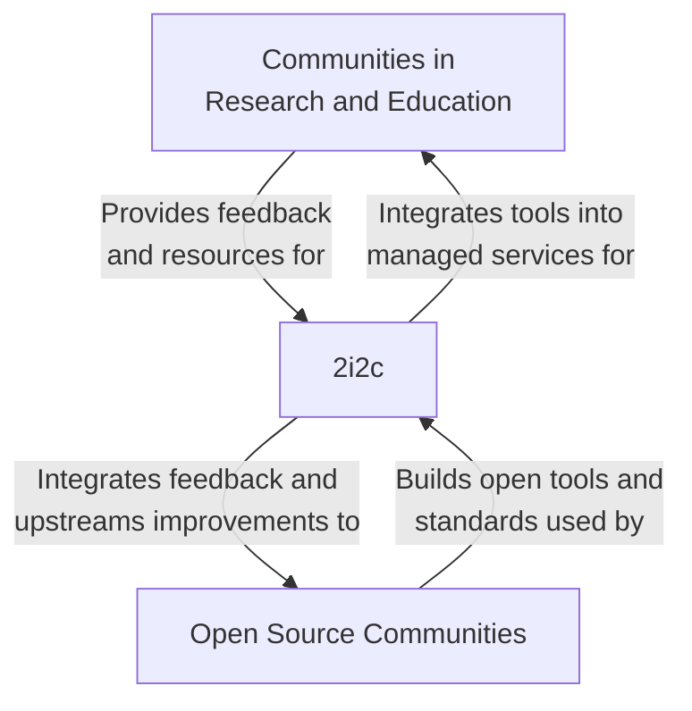

_This post is an exploration of 2i2c's current strategy and direction after a year of major operations. It is a brainstorm from the Executive Director, shared as a blog post to invite feedback and provide transparency into our current thinking. Its goal is to explore the context of 2i2c's stakeholders and their needs, and identify an opportunity and plan for having a positive impact with these communities. It is not a concrete proposal but a snapshot of thinking in time meant to trigger reflection. Over time we will incorporate some of these ideas [into our Team Compass](https://compass.2i2c.org/)._

When we founded 2i2c, we largely did so from the "bottom up" - we identified several patterns around hosted infrastructure that were useful at [UC Berkeley](https://datahub.berkeley.edu), [Pangeo](https://pangeo.io), and similar communities, and we wished to make them more generalized, accessible, and scalable.

We defined our mission as the following:

> Our mission is to make research and education more impactful, accessible, and delightful by developing, operating, and supporting infrastructure for interactive computing.

And a description about our immediate activities to make things a bit more concrete:

> 2i2c designs, develops, and operates JupyterHubs in the cloud for communities of practice in research & education. It builds and supports open source infrastructure that serves these communities.

Around a year ago [we began our pilot JupyterHubs project](http://2i2c.org/blog/2021/six-month-update/) to learn more about our biggest challenges and opportunities in making interactive computing more accessible and useful for research and education.
While both of these statements are still accurate, over the past year we've also learned more about the value that 2i2c provides. This post is an exploration of how these statements and our strategy may evolve in the near future.

## What did we miss with our original strategy?

In short: it is too-focused on **actions** rather than **impact**.

While running JupyterHubs is a key part of what 2i2c does, it is a means to an end rather than our end-goal.
Infrastructure is only useful if it changes workflows in a way that aligns with the goals and values that we wish to achieve.
We've historically defined these in a few scattered places. For example, here are the values listed on our website:

> - 2i2c values fairness and justice as requirements for successful communities.
> - 2i2c values learning and discovery for all people.
> - 2i2c values collaborating and connecting to foster environments for learning and discovery.

However, it is difficult to tie our operations directly to values and goals without making them concrete, and without defining a plan that ties them to our work.

Through our JupyterHubs pilot, we've learned how our actions-focused approach was missing some important aspects of these broader goals.
For example, we came to understand that a big part of 2i2c's value isn't just providing a JupyterHub, it is _de-risking cloud native workflows_ for communities that are inherently skeptical of what cloud infrastructure offers.
Doing this entails many things: teaching, making decisions on behalf of others, supporting and answering questions, building trust, and yes, managing infrastructure.

### Refining our strategy

With this in mind, we'd like to **make our strategy more clearly-defined and tied to our operational choices**. Here are a few ways we'd like to do this:

- Define our organization's **values and vision** for the impact we wish to have.
- Define the key **stakeholder communities** that we wish to serve, the context of tools and services that are relevant to these stakeholders, and the assumptions we're making.
- Define the **problems these stakeholders have**, the ways in which their current workflow could be improved, and the opportunity to help them.
- Describe our **strategy** to positively impact these stakeholders with our work.
- Define a collection of **goals and objectives** to carry out this strategy in the near-term.

The rest of this post will take a crack at answering a few of these questions. It is intentionally messy, and meant both as a public snapshot of my thinking at this moment, and fodder for discussion and more specific proposals in the future.

## Context: Our key stakeholders and the impact we wish to have

2i2c's key stakeholders are communities of practice that are dedicated to creating and sharing public knowledge.
These are primarily made up of **researchers** and **educators** in the global community.

For these stakeholders, we wish to catalyze and support a transformation in their data workflows that allows them to be more collaborative, inclusive, efficient, and powerful in the impact they wish to have.

### Assumptions we make about our stakeholders

There are a few unique things about these communities that are important for us:

- Researchers and educators see their job as **creating and sharing knowledge with a heterogeneous and global community**. They can't make many assumptions about the organizational context or resources of this community, or their work will become inaccessible to others.
- They **work at vertically-oriented institutions** (e.g., a university with an in-house IT department), but their communities are **organized horizontally across institutions** (a researcher may identify more with colleagues in their field than with their co-workers at the university).
- As a result, these communities **value workflows that are maximally accessible, portable, modular, simple, and long-lasting**. This allows them to define a shared set of practices across their institutional boundaries without requiring a lot of vertical decision-making.

Historically, this means that scientists must choose between workflows that are underpowered but accessible (e.g., collapsed into a PDF describing the work), or powerful but inaccessible to many (e.g., they rely on extensive training or resources only accessible to some institutions).

### Open source tools have boosted standardization and collaboration across communities

Over the past ten years, the proliferation of open source tools has vastly expanded our potential to create public knowledge in a more accessible, modular, inclusive, and productive way.

For example, core numerical computing infrastructure like [NumPy](https://numpy.org) provides a foundation for more domain specific numerical libraries to build on. Tools like [Pandas](https://pandas.pydata.org/) and [XArray](https://xarray.dev/) allow for more sophisticated data structures that match the complex and heterogeneous data in the research community.

This has led to many domain-specific communities of practice building upon the same APIs and infrastructure to solve their specific needs. By largely sharing the same stack, we have reduced duplication of effort and make it easier to speak the same language across data-rich fields.

### ...but a local workflow with open source tools is inaccessible or underpowered for many people

However, this has also led to a few key problems:

**Problem 1: The ecosystem of open source tools is huge and complex, and hard to tailor for specific domain workflows**. It is hard to decide which tools to use for a workflow, and we do not have efficient community processes for creating and standardizing workflows.

**Problem 2: For many users, it is still too difficult to set up a local environment**. Installing the right libraries and their dependencies is complex and domain-specific. This leads to wasted time and confusion, especially for newcomers or learners in an educational context.

Finally, there is another workflow-related problem that arises even when you do set up a proper environment:

**Problem 3: Local workflows are not scalable enough for many communities**. Working with 10GB of data can be challenging in a local context, working with 10TB of data quickly becomes impossible. This leads to communities that "share data" by making lots of local copies that are distributed to individual users. This harms data provenance and makes our work less reproducible and accessible. It limits the scope of questions we can ask with data and increases the friction for sharing our work with others. As our workflows require more computation and data, a "local, fixed hardware" approach will become more and more underpowered.

## Managed cloud services can solve the accessibility problem for many workflows and tools

One way to resolve these problems is to rely on **managed infrastructure services** to provide the environments needed for data analysis. A systems administrator can set up computing and data resources, and then expose these resources to many users as a service. This makes these complex and powerful environments more accessible, standardizes the workflows of users to make it easier for them to collaborate, and potentially serves as a gateway to more complex data and computing infrastructure.

Historically, this work was done in-house by internal teams at research institutions. This led to many unique infrastructure setups with slight differences across institutions. It also led to data and workflows being institution-centric, even though many communities are organized *across* institutions.

**Cloud infrastructure can solve this problem**. It provides a layer of infrastructure that can be used to standardize access and worfklows across communities of practice. It can be more accessible than on-prem infrastructure, as the cloud is already globally distributed in a way that local hardware can never be. Moreover, cloud infrastructure is also much more scalable, and can be used to access more sophisticated data and computing resources in a fluid manner.

### But the cloud services landscape is not designed for research and education communities

Over the last 10 years, a huge ecosystem of cloud-native tools and services have grown to solve this problem in industry. These are often called the [Modern Data Stack](https://future.com/emerging-architectures-modern-data-infrastructure/). However, **modern cloud services are largely unused by research and education**. Why is this?

We believe it is because most cloud services do not meet many needs of research and educational communities:

- They tend to be offered by a single vendor, which results in a fear of lock-in or vendor-specific workflows that result in high-costs.
- They require users to learn non-standard workflows that are attached to the cloud service.
- They often require extensive knowledge of data and cloud resources to configure properly. They may require an internal dev-ops team to integrate cloud services and expose them for internal teams.
- They are often still institution-centric because cloud services are geared towards enterprise contracts within vertically-integrated organizations. Many research organizations are more like collections of little fiefdoms rather than a single kingdom.

In short, **many cloud services ask researchers and educators to give up too much agency and choice, and make them reliant on organizations they do not inherently trust**. They are perceived as a risky alternative to the "we have control and have visibility into everything" nature of on-prem hardware.

### Examples of a potential model for community-centric cloud services

Over the past several years we have seen several communities strike a balance that made cloud infrastructure more accessible while still retaining agency for the communities of practice that used and managed the infrastructure.
For example:

- **The Pangeo Project** is a [cloud-native geospatial analytics platform](https://pangeo.io) that builds on the Dask, Zarr, and XArray stack to enable distributed and collaborative access to large-scale geospatial datasets.
- **The UC Berkeley DataHub** is a [cloud-native educational community](https://docs.datahub.berkeley.edu/en/latest/) that uses a managed service to provide interactive learning environments to thousands of students via the cloud.
- **The Syzygy service** is a [federated network of educational hubs](https://syzygy.ca/) that run entirely on open source infrastructure in the cloud, managed for universities in Canada.

Each of these communities roughly followed the same model:

- **Integrate** a collection of open source tools and cloud services into a standardized cloud environment for a community.
- **Customize** the environment and cloud resources via open source tools that provide remote interactive computing sessions. This is usually done with [JupyterHub](https://jupyterhub.readthedocs.io).
- **Contribute** to upstream tools and redeploy improvements to a community's shared infrastucture in order to enhance the service.

Moreover, they use nearly identical technical stacks: some combination of Jupyter infrastructure to manage cloud infrastructure and provide interactive computing environments, a Scientific Python or R-based stack for the libraries users access, and a collection of online services to facilitate collaboration and workflows.

These services required a combination of **dev-ops and cloud engineering** skills to integrate the tools and manage the infrastructure, as well as **community guidance and teaching** to standardize and share workflows across a community.

So why couldn't this model just be repeated across many other communities as well?

### However, running your own cloud infrastructure is a lot of work

These initiatives demonstrate the potential of building community-centric cloud services on top of open source tools, but they were also unscalable to other communities. Observing these success stories also reveals a few more problems that we must resolve in order to make these services more generalizable and accessible to new communities:

**Problem 4: Running your own cloud requires skills and resources that most organizations do not have**. In order to make the most of the cloud and to provide it as a resource reliable-enough for important workflows, it is important to have a knowledgeable team with best-practices in distributed cloud management. However, hiring engineers in this space is very difficult, and the team structure and culture needed for these services is often at-odds with the way universities are structured.

**Problem 5: Contributing to open source communities requires dedicated time and skills**. When building services on top of open source tools, you will invariably need to improve the tools in order to fix bugs or to enhance your service. Doing this is very different from a contract with a traditional vendor, and requires building skills in how to communicate and interact with open source communities. For key open source infrastructure, it also requires an ongoing investment of time into upstream community work that is hard for many institutions to justify.

**Problem 6: When institutions run their own clouds, they tend to re-invent institution-centric anti-patterns.** For example, an institution might expose a cloud-based service but make it available only to individuals with an institutional account.
They might staff it with an under-resourced team (or just a single person). They might make small decisions that differ from institution to institution. All of this limits the effectiveness of the cloud for facilitating collaboration and sharing within communities of practice.

Finally, while vendor-specific cloud services often come with a lot of training material, self-managed cloud services require institutions to build their own practices and guidance for how to use the infrastructure. This results in another major problem:

**Problem 7: Communities need assistance in understanding what is possible with cloud-native workflows, and adapting these workflows to their domains.** There is enormous value in integrating tools together and exposing them as a highly-accessible managed service via the cloud. However, most communities of practice are still new to cloud-native workflows, and they need considerable guidance to begin sharing their practices within a community.

These are several major problems that we must overcome in order to make cloud infrastructure more accessible and useful to research and education communities while living up to our values of community agency and open workflows.

## Our opportunity for impact

To summarize, we believe that there is the following opportunity for impact:

- Make communities in research and education do work that is more collaborative, reproducible, and impactful...
- In a way that gives them agency and flexibility to do their work as they wish...
- By integrating open tools and standards, managing them as a service with scalable cloud infrastructure, and guiding communities in deciding how to use these tools for their domain-specific problems...

We believe that the best way to do this is via a mission-aligned non-profit service that is based on values of trust, shared responsibility, and transparency. This will allow us to treat our relationships with communities as **collaborators, not customers** and share responsibility and agency with them. In this way we can act as a vehicle for **sharing resources and ideas across communities** via our infrastructure and services.

We can make such a service both **sustainable** and **scalable** because we are delivering direct value to communities with resources. There are many [potential business models](https://www.ffwd.org/playbook/choose-a-business-model/) that are already in existence (for example, _Software as a Service_ or shared research infrastructure services like supercomputing centers). By generating resources in exchange for these services, we can **centralize cloud infrastructure services for many communities into a single, scalable team**.  By committing ourselves to an _upstream-first service model_, we can **drive resources towards open source communities** and make these tools more useful for our key stakeholders.

A model like this naturally sets up a two-directional virtuous cycle where open source communities and public knowledge communities derive value from one another's work.

### How should 2i2c try to achieve this impact

With this in mind, we hope to focus our organizational efforts around building services that focus on the following actions.

- **Integrate** open source tools and services into a cloud-native service that is optimized for scientific workflows and communities. The end-product should not feel like "a 2i2c product" but a service anybody with enough skills could build themselves.
- **Manage** cloud infrastructure with an "upstream first" mentality to provide a high-quality and accessible service for global communities. This will allow communities to focus on their work instead of the infrastructure.
- **Support** the communities that use this infrastructure so that questions and problems are dealt with quickly. This will de-risk the service (and the cloud more generally) with the knowledge that help is available.
- **Guide** communities in using these tools to do their work more effectively and collaboratively. This will speed up the learning and sharing process so that communities are able to make the most of the cloud.
- **Collaborate** with these communities and embody the values we want to see in the research community to build trust and lead others. This will build trust and strengthen relationships between our communities.

Over time, we may add new verbs (such as **develop** open source software and **lead** open source communities), but the ones above define our initial organizational focus.

### Our most important actions to take

Accomplishing this requires blending aspects of cloud infrastructure management, domain and workflow expertise, and collaborative service design. As we move forward, these are the biggest challenges to overcome in developing this service further:

1. **Build a top-notch global Site Reliability Engineering Team**. First and foremost, the infrastructure that we manage must be reliable and scalable. If you ask communities to do their work in the cloud, they must be confident that it will be stable and highly available. If you wish to serve a global community, then you must build systems management capacity on a global level. This means investing heavily in our asynchronous coordination and communication processes, and building team skills in the modern cloud infrastructure stack and dev-ops practices.
2. **Build centralized cloud deployment infrastructure for community-first services**. We need the ability to centrally manage infrastructure that is delivered in a community-specific manner to many different communities of practice. This will allow us to achieve economies of scale in managing and running the infrastructure, while allowing communities to have agency over their tools to customize them for their needs. To do this we'll need to use open source tools and cloud services that are designed for flexibility and modularity, create out-of-the-box infrastructure that gets communities 80% of the way there, and gives them the power to define the last 20% in a way that is sustainable for both them and our team.
3. **Define two or three scientific workflows to focus on, and integrate the right tools and services into a distribution for each**. We must identify a few scientific workflows to focus on, as well as the infrastructure stack that will be most-useful to the communities that require these workflows. We must integrate this infrastructure into a distribution that any community could pick up, but that has enough flexibility for each to solve their "last-mile problem" with customizations.
4. **Define a support and guidance model for community-first services**. Our support and guidance similarly needs to be generic enough to be scalable to many kinds of communities, but with the ability for communities to make their own customizations and have agency over their training and content. In this way we can be a centralized resource that communities can use to grow their own practice of cloud-native workflows.
5. **Identify a collaborative service delivery model that doesn't create too much overhead**. We believe that community-centric infrastructure should be transparent and participatory, and provide agency to communities in shaping their service. On the other hand, we wish to serve many different communities, and thus we must minimize the amount of labor associated with serving any particular community. As a result we must build a collaborative model of roles and expectations around our services that balances participation from community representatives against our ability to act quickly to ensure the best service possible.
6. **Identify a cost-recovery model that is globally accessible and scalable**. We wish to serve a large and global collection of communities with our services, and so we must identify a way to recover our costs such that we are not restricted to serving only the wealthiest communities in the world, and such that "cost vs. resources generated" gives us the flexibility to grow to serve a large global community.
7. **Create an upstream-first culture**. If we wish to leverage open source tools in our work, we need to build team expertise in interacting with open source communities, deploying their technology in our services, and making improvements to our service by upstream contributions to open source tools.
8. **Create an organizational culture that embodies the values we want to support**. In order to build a better, more collaborative, more inclusive network of communities of practice, we need to embody the principles we wish to help grow in other communities. This will help us build trust with organizations that are inherently skeptical of "outsourcing" responsibilities to other organizations, and will make us more effective advocates for the same kinds of practices in other communities.

There are many other issues we must tackle, but we've identified these as being crucial to 2i2c accomplishing its mission. Over the coming months we will continue to refine our practices and service model. As we learn more, we'll update our understanding of 2i2c's situation and potential for impact, and our strategy for accomplishing our mission.

We hope that this framing helps others understand our position relative to the communities we wish to serve, and the impact we wish to have. We welcome any feedback or suggestions about how we can refine these ideas to better-serve our communities.

## Appendix: Future growth

Many people also ask what the growth model looks like for 2i2c.
Our pricing strategy above should include our goal of **building a financial buffer** in order to boost the financial resiliency of the organization, and to provide us room to grow if there is an opportunity to expand our service.

While we want to focus our efforts on the strategic goals described above, here is how I think 2i2c could grow its operations and expand its impact as a next step.
These are initiatives for which we might seek grant funding to experiment with sustainable and scalable models.

- **Create a software development team**. Right now our technical efforts are focused on _integrating_ pre-existing tools and services, and _managing_ these services in the cloud. However there are many opportunities to _create_ and _enhance_ the ecosystem of tools that is out there. Doing dedicated software development is very different from Site Reliability Engineering, and we will need to build our financial and staffing capacity to dedicate team members to this work.
- **Expand the kinds of cloud services we offer**. Currently we focus our efforts around providing _research and analysis platforms_ in the cloud. These are often connected to other cloud resources (like datasets) but we do not manage them ourselves. We believe there's an opportunity to strategically grow the services we provide - most notably in the area of cloud data management and migration. However, this is beyond our current capacity and we will need to grow more before moving in this direction.
- **Create an open source support operation**. There are many things that open source communities need beyond technical improvements. Providing community, operational, and strategic support is another way that 2i2c could use its resources and experience to benefit open source communities that we work with. However, we need to better-understand how to do this in a way that is sustainable for us, and that respects open source communities as independent organizations with their own mission, strategy, and expectations.
- **Create a cloud infrastructure training operation**. Many communities we work with _aspire to run their own cloud infrastructure_. They wish to work with a trusted partner like 2i2c in the short-term, but in the long term they want to build their own capacity in running similar services. 2i2c's cloud services are a unique opportunity for others to get hands-on training to grow their skills. Perhaps there is a way for us to share this experience with members from other communities in a way that they can then bring back with them to other organizations. There will be an inherent tension between this and our sustainability model from ongoing services, but we believe it is an important opportunity to explore since it aligns with our values of community agency and choice.

{}
