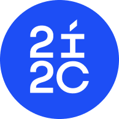
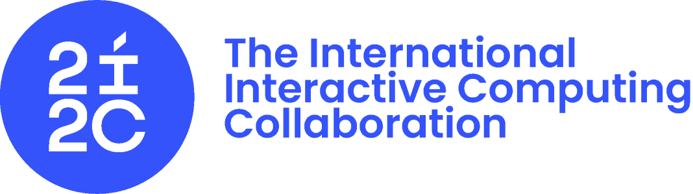
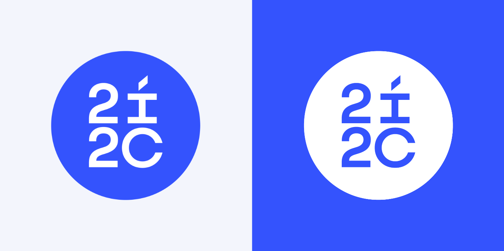
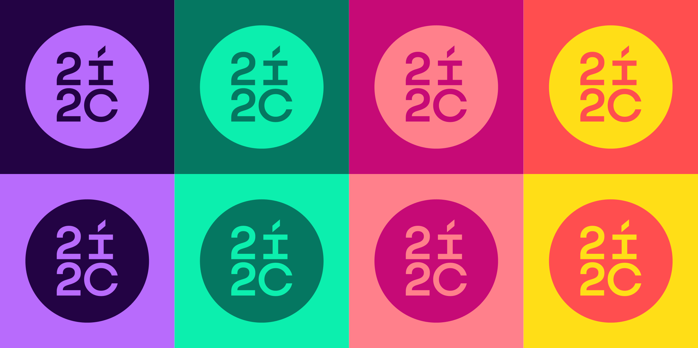
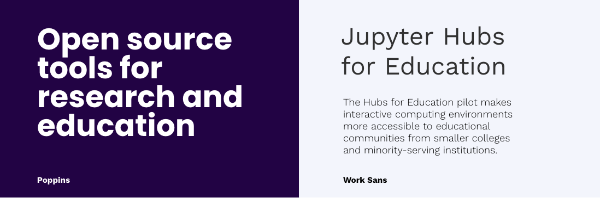
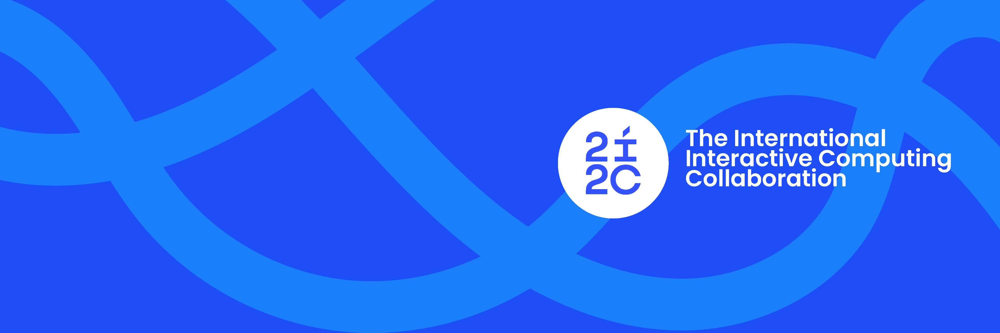

We are thrilled to announce a revitalized visual brand for 2i2c.
As we continue to grow and evolve, it's essential that our branding communicates who we are, what we stand for, and how we envision our future.
We hope that this new design will unify our visual style across the many places where 2i2c operates.

In pursuit of these objectives, we teamed up with [Zack Adell](https://www.linkedin.com/in/zacharia-adell-230a3399), a designer based in Nairobi who has worked with several similar projects over the years (having most-recently overhauled the [Invest in Open Infrastructure brand design](https://investinopen.org/blog/introducing-our-new-logo-and-visual-identity/)).
After several rounds of brainstorming, design reviews, and fine-tuning, we've landed on a visual identity that resonates with our organization.

## Meet Our New Logo and design system

Zack has created [a set of Brand Guidelines](https://docs.google.com/presentation/d/1O36_yjTSKiXB9_yAnj4QnF_sob1z_GQmcfIVrZ_ymeY/edit?usp=sharing) that will guide our use of color and visual style in 2i2c's materials.

Below is our new logo in square and wide form:

Our logo comprises the `International Interactive Computing Collaboration` wordmark, characterized by our interactive `i`.
We can fly it just about anywhere.
A mark of constant progress & community-driven technology, it isn't stuck to the borders that separate people.
It brings us closer together.

Our primary and secondary color palette is below:

Color is the first visual thing we remember and a powerful asset in building brand recognition.
Our color is blue.
Our community blue says the sky is not the limit. It's energetic and vibrant, just like the community we serve.
And it's our primary colour, supported by a lively secondary palette that's as at home on digital platforms as it is on billboards.

We've chosen two fonts to use in the majory of the text that we write.
`Poppins` for big, bold sentences, and `Work Sans` for more versatile and everyday use.

Finally, you might notice these curving, criss-crossing strands in some of our materials.
For example, in our new social media header:

They're the strands that intersect and show how our work and values are interconnected to our community.
We like them because they represent 2i2c's core mission, which is to build connections between people, computation, and data in order to share open knowledge.
We'll try and think of creative ways to incorporate them into our visual style.

We believe our new visual identity is more than just a fresh coat of paint.
It's a reaffirmation of our commitment to our stakeholders and an exciting milestone in our ongoing journey.
We can't wait for you to see it in action, and are excited to hear what you think about it!

> ❗ **Note**
>
> If you'd like to get in touch with Zack Adell, please reach out on [his LinkedIn profile](https://www.linkedin.com/in/zacharia-adell-230a3399/), or [his Instagram account](https://www.instagram.com/iamzackadell/).