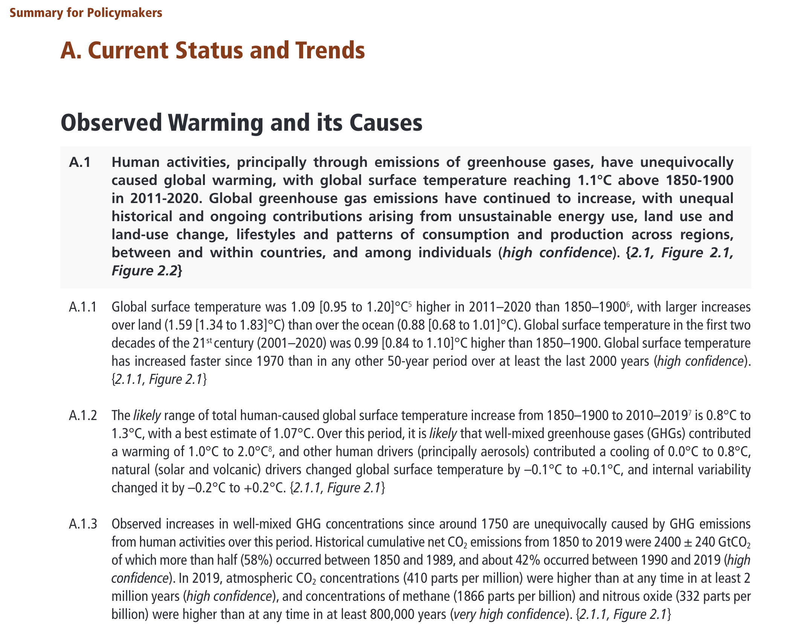
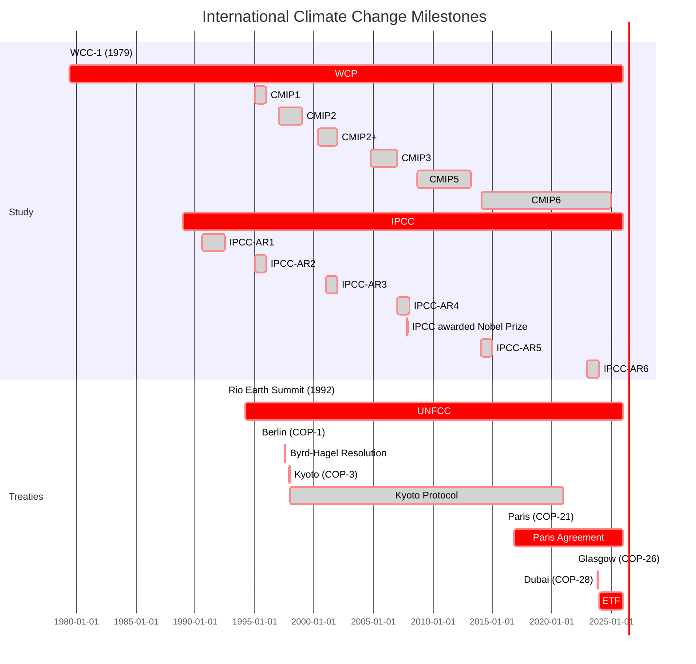

> **Abstract**
>
> The International Interactive Computing Collaboration ([2i2c.org](https://2i2c.org)), working with [NASA VEDA](https://www.earthdata.nasa.gov/dashboard/), [Development Seed](https://developmentseed.org/) and other partners, operates an interactive computing platform for The U.S. Greenhouse Gas Center. The U.S. GHG Center, [announced yesterday](https://www.nasa.gov/news-release/nasa-partners-launch-us-greenhouse-gas-center-to-share-climate-data/) at the 28th annual United Nations Climate Conference (COP-28) in Dubai, is an interagency collaboration of the [Environmental Protection Agency (EPA)](https://www.epa.gov/), the [National Aeronautics and Space Administration (NASA)](https://www.nasa.gov/), the [National Institute of Standards and Technology (NIST)](https://www.nist.gov/), and the [National Ocean and Atmospheric Administration (NOAA)](https://www.nist.gov/). This note places the launch of the U.S. GHG Center in a scientific, international, and national context and argues that similar digital public goods are needed for humanity to understand and manage the Earth system. 

## Scientific Context

It was controversial in 1827 when Joseph Fourier (the discoverer of the [law of heat conduction](https://en.wikipedia.org/wiki/Thermal_conduction#Fourier's_law)) argued [^fourier2013] that the atmosphere keeps the Earth warm, like a puffy down comforter, but it's not now. Gases in the atmosphere trap heat near Earth. How much heat is trapped depends on the gas mixture. Putting more heat-trapping gases in is like putting a wool blanket on top of the down comforter. Human activity since industrialization is injecting lots more heat-trapping gas into the atmosphere and changing the Earth's climate.

The science is clear. The up-to-date consensus view of the global scientific community is expressed in the [Sixth Assessment Report](https://www.ipcc.ch/assessment-report/ar6/) of the Intergovernmental Panel on Climate Change (IPCC): 

## International Context

The international community officially recognized human-influenced climate change at the World Climate Conference (WCC-1) [^worldclimateconference1979] in 1979. The [1979 declaration](https://library.wmo.int/viewer/54699/download?file=1979_wcc1-declaration.pdf&type=pdf&navigator=1)is remarkably prescient and detailed. A complex and interconnected collection of scientific and diplomatic activities were catalyzed by WCC-1. Some important milestones from this history are captured in the chart and numbered list below. 

The table above describes a subset (for a more systematic review see [^gupta2010], [^zillman2009]) of key milestones in global efforts to understand and address climate change. A glossary of acronyms and additional background:
 
1. The First World Climate Conference (**WCC-1**) [^worldclimateconference1979] was held in 1979.
2. The World Climate Programme ([WCP](https://public.wmo.int/en/programmes/world-climate-programme)), an activity overseen by the [World Meteorological Organization](https://public.wmo.int/en) was established after WCC-1. WCP, in partnership with other organizations, operates programs (e.g. the [World Climate Research Program (WCRP)](https://wcrp-cmip.org/)) that organize and integrate international scientific efforts to understand the climate. The WMO also operates the [Integrated Global Greenhouse Gas Information System (IG3IS)](https://ig3is.wmo.int/en/who-we-are), a natural partner for the emerging work described below.
3. WCRP manages the [Common Model Intercomparison Project (CMIP)](https://wcrp-cmip.org/). CMIP serves as a kind of **league for intercomparing models** of the Earth's climate system developed by teams who approach the problems with different methods and designs. Intercomparison, an approach that enables finding the consensus views of teams with divergent approaches to problems, is used in other modeling scenarios.
4. Research papers on the climate are rapidly produced by scholars from essentially all knowledge disciplines. This overwhelming stream of content, like snowflakes in a blizzard, is coalesced into coherent and carefully scrutinized **[IPCC Assessment Reports](https://www.ipcc.ch/reports/)** by the [Intergovernmental Panel on Climate Change (IPCC)](https://www.ipcc.ch/). 
5. The [Earth Summit](https://en.wikipedia.org/wiki/Earth_Summit) held in Rio de Janeiro in 1992 led to the [United Nations Framework Convention on Climate Change (UNFCC)](https://unfccc.int/). The UNFCCC is an international treaty that recognizes the dangers to the climate system caused by human activity, calls for ongoing study, and establishes recurring [Conference of the Parties (COP)](https://unfccc.int/process/bodies/supreme-bodies/conference-of-the-parties-cop) meetings. 
6. [COP-3 (Kyoto)](https://unfccc.int/event/cop-3) led to the [Kyoto Protocol Treaty](https://unfccc.int/kyoto_protocol). 
7. The [Byrd-Hagel Resolution](https://en.wikipedia.org/wiki/Byrd%E2%80%93Hagel_Resolution) was a unanimous United States Senate Resolution that stipulated the United States would not sign treaties promising greenhouse gas reductions by developed countries that did not mandate similar reductions from developing countries. This killed USA participation in the Kyoto Protocol Treaty. 
8. The [Paris Agreement](https://unfccc.int/process-and-meetings/the-paris-agreement), established at [COP-21 (Paris)](https://unfccc.int/event/cop-21), effectively replaces the Kyoto Protocol, includes specifications by participant countries on greenhouse gas reductions called _National Determined Contributions_ (NDCs). The United States entered the Paris Agreement under President Obama, exited under President Trump and rejoined under President Biden. 
9. [COP-26 (Glasgow)](https://www.un.org/en/climatechange/cop26)established an accountability system for the Paris Agreement called the [Enhanced Transparency Framework (ETF)](https://unfccc.int/FAQ-moving-towards-the-ETF). Participant countries to the Paris Agreement will [submit their first Biennial Transparency Reports (BTR1) under the ETF](https://unfccc.int/process-and-meetings/transparency-and-reporting/preparing-for-the-ETF) in 2024. 

## 🇺🇸 U.S.A. Context

The [United States Environmental Protection Agency (EPA) annually releases](https://www.epa.gov/ghgemissions/inventory-us-greenhouse-gas-emissions-and-sinks) the _Inventory of U.S. Greenhouse Gas Emissions and Sinks_ reports. These reports are submitted to the United Nations in accordance with the UNFCCC. The EPA [openly shares](https://www.epa.gov/ghgemissions/greenhouse-gas-inventory-tools) software, tools, data, and [builds capacity](https://www.epa.gov/ghgemissions/capacity-building-national-greenhouse-gas-inventories) to assist other nations to assemble their own greenhouse gas inventories.   

An [Interagency Working Group (IWG) on the Social Cost of Carbon](https://obamawhitehouse.archives.gov/sites/default/files/omb/inforeg/for-agencies/Social-Cost-of-Carbon-for-RIA.pdf) was set up by the Obama Administration in 2010. The IWG, renamed as the [Interagency Working Group on Social Cost of Greenhouse Gases in 2016](https://www.epa.gov/sites/default/files/2016-12/documents/sc_co2_tsd_august_2016.pdf), synthesizes research on [integrated assessment modelling](https://en.wikipedia.org/wiki/Integrated_assessment_modelling) to quantify the dollar costs associated to damage caused by an incremental increase in GHG emissions in a given year. Quantifying the impacts of GHG emissions in monetary terms is vital to effective rulemaking across the Federal Government.  This [EPA fact sheet on the social costs of carbon](https://www.epa.gov/sites/default/files/2016-12/documents/social_cost_of_carbon_fact_sheet.pdf) provides further background. A 2017 consensus report [^nasem2017] of the National Academies of Science Engineering and Medicine (NASEM) offered recommendations for ongoing research to improve the assignment of social costs to GHG emissions. 

Other federal agencies have developed expertise, data, and analyses that give insights into GHG emissions that compliment and potentially extend the _Inventory_ reports developed annually by the EPA. How should the United States integrate federal agency efforts to monitor and measure greenhouse gas emissions? A 2022 NASEM consensus report [^nas2022] investigated this question. In January of this year, the [Biden Administration](https://www.whitehouse.gov/ceq/news-updates/2023/01/06/biden-harris-administration-releases-new-guidance-to-disclose-climate-impacts-in-environmental-reviews/) released guidance[^ceqguidance2023] for federal agencies on incorporating GHG emissions information in policies and reports. Shortly thereafter, a draft federal strategy to advance an integrated greenhouse gas monitoring system was [released by NASA with a request for public input](https://nspires.nasaprs.com/external/solicitations/summary.do?solId={DDD1BC85-9276-8FB7-C362-A00E3E427E0D}&path=&method=init).  

Some important insights from the NASEM consensus report, the draft federal strategy, and the IWG reports:

1. Data streams on greenhouse gas emissions can be sorted into two broad categories:
	+ **Activity-based:** Activity-based data, sometimes called "bottom-up" data, quantify GHG emissions by measuring activities that generate GHG emissions. Economic or business activity data (gallons of diesel sold in a county on Tuesday; miles flown by a 747 in October) can be converted into quantified GHG emissions information. 
	+ **Atmospheric-based:** Atmosphere-based data, sometimes called "top-down" data, quantify GHG emissions by performing atmospheric measurements. For example, the [Orbiting Carbon Observatory (OCO2)](https://ocov2.jpl.nasa.gov/) remotely senses $CO_2$ from space.
	+ A hybrid approach that blends activity-based and atmospheric-based GHG data has the potential to provide new insights. 
2. Interoperable and easily accessed tools and data products for analyzing GHG emissions information and assigning costs should be made available across the Federal government. 
3. GHG emissions information is needed in scenarios outside the international context of participating nations reporting for UNFCCC and Paris Agreement ETF compliance:
	+ **Subnational governments** -- cities, states, provinces, counties -- want GHG data products to measure their progress on emission reduction programs.
	+ **Facilities** -- harbours, toll roads, power plants, factories, universities -- similarly want GHG data products. 
	+ **Companies** -- airlines, trucking, construction -- want GHG data products.
4. Reliable and transparent GHG emissions information is required to enable effective environmental-social-governance (ESG) investment without “greenwashing”.
5. Accurate and improving quantifications of the social costs associated to GHG emissions require ongoing research. 

## The U.S. Greenhouse Gas Center

The launch of U.S. GHG Center, an interagency collaboration of the [Environmental Protection Agency (EPA)](https://www.epa.gov/), the [National Aeronautics and Space Administration (NASA)](https://www.nasa.gov/), the [National Institute of Standards and Technology (NIST)](https://www.nist.gov/), and the [National Ocean and Atmospheric Administration (NOAA)](https://www.nist.gov/), was [announced on 2023-12-04](https://www.nasa.gov/news-release/nasa-partners-launch-us-greenhouse-gas-center-to-share-climate-data/) at COP-28 (Dubai)

How much GHG emission is generated through oil and gas production? How much GHG emission is generated by urban centers? Do landfills contribute significant GHG emissions? How do human-generated GHG emissions compare to natural sources of GHG emissions? The U.S. GHG Center is designed to assemble the data, tools, and people to scientifically address these kinds of questions.  

## Openness: Amplified Knowledge Sharing

The U.S. Greenhouse Gas Center builds on [EPA's leadership to openly share the data and tools for the _Inventory_](https://www.epa.gov/ghgemissions/greenhouse-gas-inventory-tools)and the [2023 Year of Open Science](https://www.whitehouse.gov/ostp/news-updates/2023/01/11/fact-sheet-biden-harris-administration-announces-new-actions-to-advance-open-and-equitable-research/). Instead of building a walled garden with proprietary technology from a vendor selected through RFP, the Center launched a prototype platform using curated open source tools integrated with public federal data. This **open toolchain approach** amplifies the open data efforts developed over the past two decades.
 
The U.S. GHG Center's interactive computing platform is **open source science infrastructure**. The platform is: 
1. [transparently operated](https://github.com/2i2c-org/infrastructure) by [2i2c](https://2i2c.org) on a cloud data center under a [right to replicate that ensures zero vendor lock-in](https://2i2c.org/right-to-replicate/) with data integrations and visualizations built with using software from a [vibrant open source ecosystem](https://jupyter.org/) by [Development Seed](https://developmentseed.org/), [NASA VEDA](https://www.earthdata.nasa.gov/dashboard/), and collaborators;
2. proximate to and optimized [^abernathey2021] for analyzing geospatial data (e.g. [NASA](https://registry.opendata.aws/collab/nasa/), [NOAA](https://repository.library.noaa.gov/view/noaa/37529));
3. designed to be a _digital public good._

Research, data and recommendations developed by scientists and engineers that influence policies set by democratic governments should be accessible by voters. No entity should own the ways humans communicate and learn about the Earth system. The U.S. Greenhouse Gas Center's generous approach to digital infrastructure -- an open toolchain adjacent to open data -- is vital for democracy and should be replicated across government agencies worldwide.

## References

[^fourier2013]: Mémoire sur les températures du globe terrestre et des espaces planétaires. in _Oeuvres de Fourier: Publiées par les soins de Gaston Darboux_ (eds. Fourier, J. B. J. & Darboux, J. G.) vol. 2 95–126 (Cambridge University Press, 2013).

[^worldclimateconference1979]: World Climate Conference. _World Climate Conference - Declaration and supporting documents_. [https://library.wmo.int/records/item/54699-world-climate-conference-declaration-and-supporting-documents](https://library.wmo.int/records/item/54699-world-climate-conference-declaration-and-supporting-documents) (1979).

[^gupta2010]: Gupta, J. A history of international climate change policy. _WIREs Climate Change_ **1**, 636–653 (2010).

[^zillman2009]: Zillman, J. A history of climate activities. _WMO Bulletin_ **58**, (2009).

[^nasem2017]: _Valuing Climate Changes: Updating Estimation of the Social Cost of Carbon Dioxide_. (National Academies Press, 2017). doi:[10.17226/24651](https://doi.org/10.17226/24651).

[^nas2022]: _Greenhouse Gas Emissions Information for Decision Making: A Framework Going Forward_. (National Academies Press, 2022). doi:[10.17226/26641](https://doi.org/10.17226/26641).

[^ceqguidance2023]: CEQguidance. National Environmental Policy Act Guidance on Consideration of Greenhouse Gas Emissions and Climate Change. _Federal Register_ [https://www.federalregister.gov/documents/2023/01/09/2023-00158/national-environmental-policy-act-guidance-on-consideration-of-greenhouse-gas-emissions-and-climate](https://www.federalregister.gov/documents/2023/01/09/2023-00158/national-environmental-policy-act-guidance-on-consideration-of-greenhouse-gas-emissions-and-climate) (2023).

[^abernathey2021]: Abernathey, R. P. _et al._ Cloud-Native Repositories for Big Scientific Data. _Computing in Science & Engineering_ **23**, 26–35 (2021).
