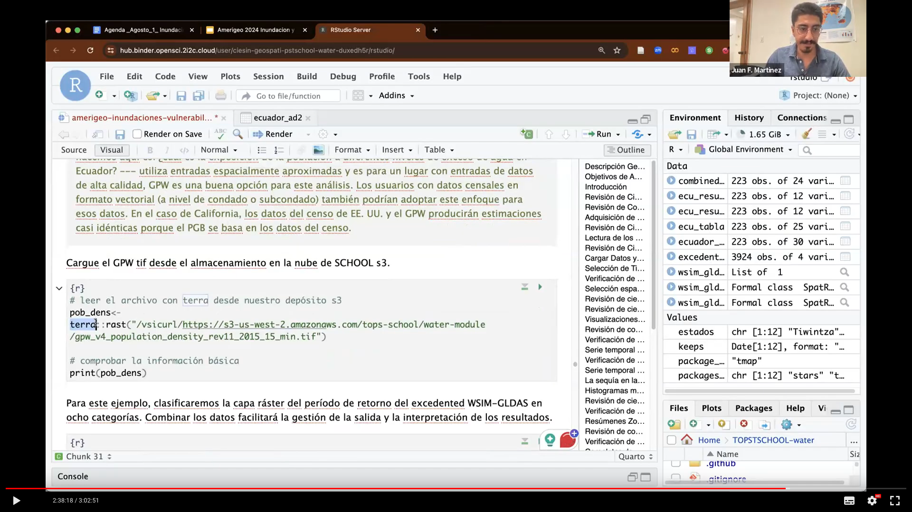

[AmeriGEO](https://www.amerigeo.org/) provides a framework for cooperation in the Americas for the use of Earth data to benefit science and society with data driven decision-making. As part of a virtual workshop held on 1st August 2024, 2i2c provided an interactive computing environment to support the delivery of a [NASA TOPST](https://www.nasa.gov/centers-and-facilities/marshall/nasa-boosts-open-science-through-innovative-training/) water module.

The workshop was facilitated by [Kytt MacManus](https://people.climate.columbia.edu/users/profile/kytt-macmanus) and [Juan F. Martinez](https://ciesin.climate.columbia.edu/directory/juan-f-martinez) (both of [CIESIN](http://www.ciesin.columbia.edu/), Columbia University, New York). Juan presented interactive R code, with explanatory content written in Quarto, for hotspot vulnerability analysis for floods and landslides focused on Ecuador using earth observation data and socioeconomic data to develop an index of vulnerability. Check out their [GitHub repo](https://github.com/ciesin-geospatial/TOPSTSCHOOL-water) and [explore interactively yourself](https://tinyurl.com/TOPSTSCHOOL) on our BinderHub (see our blog post for more details of how to access the BinderHub deployments to provide [Ephemeral Interactive Computing for NASA Communities](/blog/nasa-ephemeral-hubs)).

Over 100 participants were able to access the interactive workshop on our infrastructure, with 8 GB of RAM per user to facilitate the processing of large amounts of earth data. We are pleased that the workshop was successful and the platform was able to provide a great experience for participants. After the workshop, Kytt reported that

>The technology worked as expected and we didn't run into 1 major technical problem. Thank you so much for that!".

## Acknowledgements

- Funding from Science Mission Directorate’s Open Source Science Initiative, Research Opportunities in Space and Earth Science (ROSES-2022), F.14 Transform to Open Science
- NASA NSPIRES F.15 High Priority Open-Source Science Award NNH22ZDA001N-HPOSS
- [NASA Socioeconomic Data and Applications Center (SEDAC)](https://sedac.ciesin.columbia.edu/)
- Kytt MacManus
- Juan F. Martinez
- James Munroe for providing support and assistance for setting up the cyberinfrastructure for this workshop.