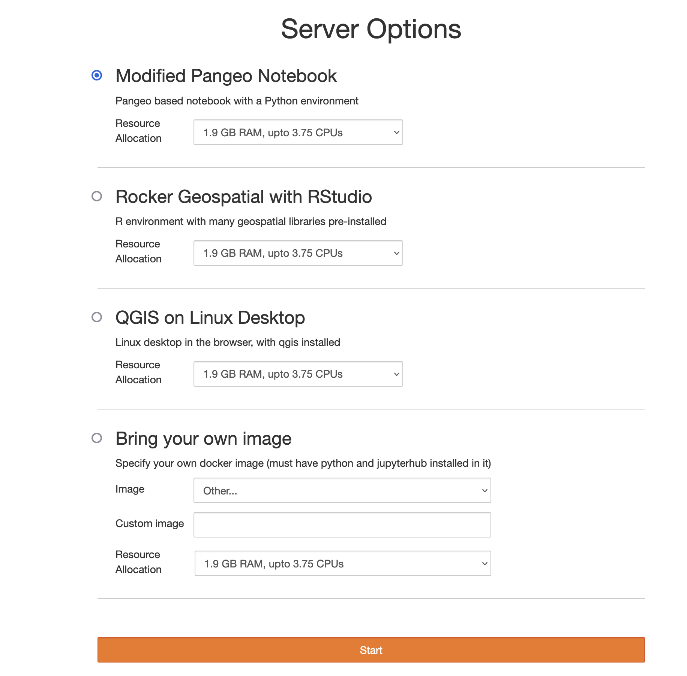

[mybinder.org](https://mybinder.org) is a very popular service that allows end users to build the environment (languages, packages, etc) needed for their notebooks to run correctly, and share that with others with just a simple link. While not without its own set of challenges, this is extremely powerful because it puts control of the *environment* in the hands of the people who write the code that has to run in the environment. They can customize the environment to fit the needs of their code, instead of having to fit their code into the environment that admins have made available.

But, mybinder.org (and the [BinderHub](https://github.com/jupyterhub/binderhub/) software that powers it) is built for *sharing* your work after you are done with it, *not* for actively doing work. [JupyterHub](https://jupyter.org/hub) is more commonly used for this, but doesn't currently posess the ability for users to easily build their own environments. Admins who are *running* the JupyterHub can make [multiple environments](https://z2jh.jupyter.org/en/stable/jupyterhub/customizing/user-environment.html#using-multiple-profiles-to-let-users-select-their-environment) available for users to choose from, but this still puts admins in the critical path for environment customization.

Our [collaboration](https://2i2c.org/blog/2022/gesis-2i2c-collaboration-update/) with [GESIS](http://gesis.org), [NFDI4DS](https://www.nfdi4datascience.de), and [CESSDA](https://www.cessda.eu), aims to bring this flexibility to JupyterHub directly. We aim to empower users to decide for themselves which applications and dependencies are installed on a per-project basis. Our work enables communities with heterogeneous requirements to share a single Hub. Our approach work frees administrators from being overwhelmed by installation requests and transforms the JupyterHub platform into a platform for computational reproducibility, a role previously reserved for BinderHub. In this update, we report on our progress and upcoming steps in this project.

## What does a BinderHub do, exactly?

It is helpful to understand that BinderHub primarily has 3 responsibilities:

1. Present a UI to the end user for them to provide details on what to build (this is what you see when you go to mybinder.org)
2. Call out to [repo2docker](https://github.com/jupyterhub/repo2docker) in a scalable way to actually *build and push* a docker image with the environment for the given repository, and show the user logs as this build process happens. This also allows users to debug issues with their build more easily.
3. Talk to a JupyterHub instance to launch a user server with the built docker image, and redirect the user to this.

(2) is really the *core* feature of BinderHub, and we settled on figuring out how to make that available to JupyterHub users using pre-existing UI, in a way that fits into the traditional JupyterHub workflow. This blog post discusses the various changes to the broad ecosystem of projects required to do get this done.

## Demo

But first, a very quick demo of how this looks like now!

<!-- generated from original .mov screen recording with `ffmpeg -i screencast.mov -c:v libx264 screencast.mp4` -->
<video src="./screencast.mp4" />

This is very much a work in progress, but the basic shape of everything is already here. This is what the user sees after they login. It allows them to specify the two primary things that determine the server they start:

1. The resources allocated (RAM, CPU and maybe GPU)
2. The environment launched (docker image), which can be specified in one of 3 ways:

    a. A pre-selected list of images, provided by the administrators who set up this JupyterHub
    b. A blank text box where you can enter any *public* docker image you want, if it has already been built and pushed to a registry
    c. A mybinder.org style way to specify a GitHub repository, which will be then dynamically built into a docker image for you to use!

So what all did we need to do to accomplish this, in a way that's very upstream friendly and usable by everyone (and not just 2i2c)?

## Standalone `binderhub-service` helm chart

The default upstream [BinderHub helm-chart](https://github.com/jupyterhub/binderhub/tree/main/helm-chart) *includes* a JupyterHub as a dependency, and configures itself to be used primarily in a manner similar to [mybinder.org](https://mybinder.org). As the person who helped make that choice early on, I can tell you why it was made - for convenience! And it *was* very convenient, as it allowed us to get mybinder.org going fast. However, it makes it difficult to install a BinderHub service *alongside* an existing JupyterHub, which we would need for our dynamic image building integration. To this end, we have created a standalone [BinderHub helm chart](https://github.com/2i2c-org/binderhub-service/), designed to be installed *alongside* an existing JupyterHub! This allows the BinderHub instance to be used as a [JupyterHub Service](https://jupyterhub.readthedocs.io/en/stable/reference/services.html), which is what we want.

As part of this, we also added a way for BinderHub to run in [API only mode](https://github.com/jupyterhub/binderhub/pull/1647), so we can fully turn off the UI *and* launching ability of BinderHub, and use it purely for its building API.

While this helm chart is currently under the 2i2c GitHub org, the hope is that it can eventually migrate to a [jupyterhub-contrib](https://github.com/jupyterhub/team-compass/issues/519) organization (once it is created), or it can become the upstream helm chart for BinderHub if enough work can be done in BinderHub to allow it to serve use cases like mybinder.org.

## Sustainably extending KubeSpawner's `profileList`

We identified KubeSpawner's `profileList` feature as the ideal location for implementing dynamic image building UI, making it just another 'image choice' people can choose, along with choosing the amount of resources their server needed. From an end user perspective, it was the logical place for them to specify a repository to build into an image, as they could already choose some pre-built images from here. They can also select other arbitrary resources they want (such as memory, GPU, etc) from here as well. From a maintainer perspective, it helps with long term maintenance of the JupyterHub projects.

The implementation of `profileList` however, was not easy to extend at this point. So [this PR](https://github.com/jupyterhub/kubespawner/pull/724) improved how easy it was to extend it in more complex ways, without making the implementation in KubeSpawner itself complicated. Even though this had *no* visible end user effects, it was an extremely important step in allowing us to experiment with UI in a *sustainable* way without having to rely on upstream. These kind of changes can sometimes be hard to sell to stakeholders, but are extremely important in ensuring a continuous and sustainable relationship with upstream.

## Implementing `unlisted_choice` feature in KubeSpawner

The profileList feature was built to allow JupyterHub *admins* to specify an explicit list of images / resources the end user can select from. It did not have a way for any image that was *not* pre-approved by the admin to be used. We had to safely add this feature to KubeSpawner in such a way that it was generally useful to everyone. Many other communities had been asking for such a feature anyway - the ability to simply 'type in' an image and have that be used.

[NASA VEDA](https://www.earthdata.nasa.gov/esds/veda) was one such community, so we partnered with [Sanjay Bhangar](https://github.com/batpad/) from [Development Seed](https://developmentseed.org/) (an organization that helps run NASA VEDA) to implement this feature. Engineers from 2i2c contributed heavily to this feature as well, and after *several* PRs ([1](https://github.com/jupyterhub/kubespawner/pull/735), [2](https://github.com/jupyterhub/kubespawner/pull/766), [3](https://github.com/jupyterhub/kubespawner/pull/773), [4](https://github.com/jupyterhub/kubespawner/pull/774) and [5](https://github.com/jupyterhub/kubespawner/pull/777)), this feature is now available for everyone to use!

A key component of doing *sustainable* upstream work is that every addition needs to be useful by itself for a broad group of people. This change was very helpful for many communities that wanted to allow their users the freedom to pick whatever image they want to use, regardless of wether they wanted to use dynamic image building or not. The broad interest allowed us to build a coalition with other interested parties, and get the change accepted upstream more easily!

## `jupyterhub-fancy-profiles`

Once we had all these pieces in place, it was time to actually work on the frontend UI that would allow users to build images dynamically and launch them. Since this will replace the 'profileList' feature, it should also allow them to select different resources (RAM, CPU, etc) as needed, as well as type-in an existing image if they desire. So it was a full re-implementation of the profileList frontend.

This is ongoing now at the [jupyterhub-fancy-profiles](https://github.com/yuvipanda/jupyterhub-fancy-profiles) project. It is a pure frontend web application, using standard frontend tooling ([React](https://react.dev/), [webpack](https://webpack.js.org/), [Babel](https://babeljs.io/), etc) and written in JavaScript. It's gone through a few revisions, but the demo provided earlier in the blog post is its current state. Because the default profileList implementation is pure HTML / CSS with very *minimal* JS, it is limited in what kinda UX it could have. `jupyterhub-fancy-profiles` aims to be very helpful *even* when dynamic image building is not enabled on a JupyterHub. We hope to roll this out to a few JupyterHubs and improve it over time based on feedback.

## [`jupyterhub/@binderhub-client`](https://www.npmjs.com/package/@jupyterhub/binderhub-client) npm package

While building `jupyterhub-fancy-profiles`, we want to use the *same* javascript code used by BinderHub frontend to interact with the BinderHub API, instead of re-implementing it. However, the existing BinderHub javascript code was not easily consumable by external projects. We refactored this, adding tests, migrating to use modern JS practices and published the [`jupyterhub/@binderhub-client` NPM package](https://www.npmjs.com/package/@jupyterhub/binderhub-client) that can be used not just by `jupyerhub-fancy-profiles` but any external project for talking to the BinderHub API.

This had to be done in such a way that current BinderHub installations (such as mybinder.org) do not break. That took quite a few pull requests: [1](https://github.com/jupyterhub/binderhub/pull/1689), [2](https://github.com/jupyterhub/binderhub/pull/1693), [3](https://github.com/jupyterhub/binderhub/pull/1694), [4](https://github.com/jupyterhub/binderhub/pull/1741), [5](https://github.com/jupyterhub/binderhub/pull/1742), [6](https://github.com/jupyterhub/binderhub/pull/1758), [7](https://github.com/jupyterhub/binderhub/pull/1761), [8](https://github.com/jupyterhub/binderhub/pull/1771), [9](https://github.com/jupyterhub/binderhub/pull/1773), [10](https://github.com/jupyterhub/binderhub/pull/1775), [11](https://github.com/jupyterhub/binderhub/pull/1778), [12](https://github.com/jupyterhub/binderhub/pull/1779), [13](https://github.com/jupyterhub/binderhub/pull/1781), [14](https://github.com/jupyterhub/binderhub/pull/1782), [15](https://github.com/jupyterhub/binderhub/pull/1783)

## `cryptnono` anti-abuse features

For Open Science to flourish, we need to allow access without login / paywalls wherever possible. A new menace against this has been [cryptojacking](https://www.interpol.int/en/Crimes/Cybercrime/Cryptojacking) - where attackers use up any and all available free compute to mine cryptocurrencies. This has affected *many* folks on the internet, including [GitHub Actions](https://www.bleepingcomputer.com/news/security/github-actions-being-actively-abused-to-mine-cryptocurrency-on-github-servers/) and mybinder.org, the primary public BinderHub installation. mybinder.org has some extra protections against cryptojacking that aren't easily usable elsewhere, and this has unfortunately meant that the imagebuilding demos have been behind a login wall. I personally believe login walls are long term antithetical to open science, and so this was an important problem to solve.

[cryptnono](https://github.com/yuvipanda/cryptnono) is an open source project designed to help fight cryptojacking, and as part of this grant we ported some of this functionality out of mybinder.org specific code into cryptnono, so other deployments may also benefit from it! As part of the port, we also migrated to using the super efficient [ebpf](https://ebpf.io/) Linux Kernel feature, allowing for more complex heuristics to catch a much broader range of cryptomining activity. We have been slowly tweaking the config here on mybinder.org, and it has proven to be very effective! This will be very helpful for *anyone* who wants to provide a JupyterHub (or any other computational service) without a login wall. If you are interested in using cryptnono in this fashion, please reach out to us so we can work together!

## Explored pathways that were then discarded

List of things that were tried and then decided as not good pathways:

- [repo2docker-service](https://github.com/consideRatio/repo2docker-service), a separate JupyterHub service that could *only* build images. As we worked on it, we realized that it was replicating a lot of features that BinderHub already has, so we pivoted to working on BinderHub directly instead.
- Building off of [tljh-repo2docker](https://github.com/plasmabio/tljh-repo2docker). While this already had a nice UI, it would be hard to port it to run on a distributed kubernetes environment without it becoming a 'hard fork'.

While these did slow down the implementation of the project, it has allowed us to be very confident that the methods we have chosen are long term sustainable.

## Future work

This is not complete of course, and there is a lot of future work to be done.

1. Better UX for specifying images, including figuring out how to 'save' them for future reuse.
2. Better compatibility with mybinder.org, particularly in allowing other sources of environments (not just GitHub, but zenodo, raw git repositories, etc) and URL compatibility
3. More thorough documentation for how you can set this up yourself on your JupyterHub installation.

## Credit

All this work would not be possible without a large group of collaborators!

- From 2i2c: [Erik Sundell](https://github.com/consideRatio), [Georgiana Elena](https://github.com/GeorgianaElena), [Yuvi](https://words.yuvi.in/), [James Monroe](https://github.com/jmunroe), and [Damián Avila](https://github.com/damianavila).
- [Dr. Arnim Bleier](https://www.gesis.org/en/institute/staff/person/arnim.bleier) from GESIS was *instrumental* in making this project happen
- The [persistent BinderHub](https://github.com/gesiscss/persistent_BinderHub/) project was the direct inspiration for all this work, with particular thanks to [Kenan Erdogan](https://github.com/bitnik)
- The [tljh-repo2docker](https://github.com/plasmabio/tljh-repo2docker) project, which explores similar ideas in the context of running only on a single node.
- The broad JupyterHub and MyBinder.org community, particularly [Simon Li](https://github.com/manics) and [MinRK](https://github.com/minrk/)
- Funding generously provided by [GESIS](http://notebooks.gesis.org) in cooperation with NFDI4DS [460234259](https://gepris.dfg.de/gepris/projekt/460234259?context=projekt&task=showDetail&id=460234259&) and [CESSDA](https://www.cessda.eu).