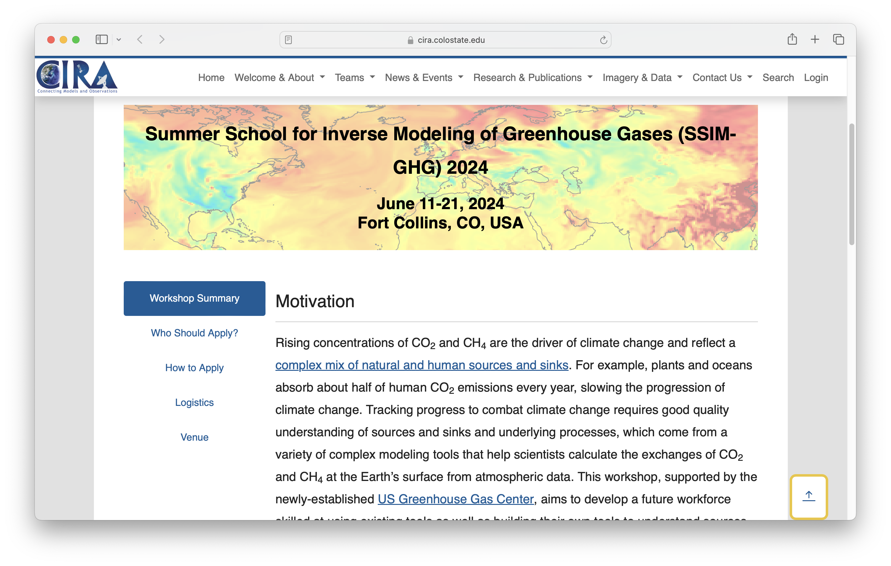
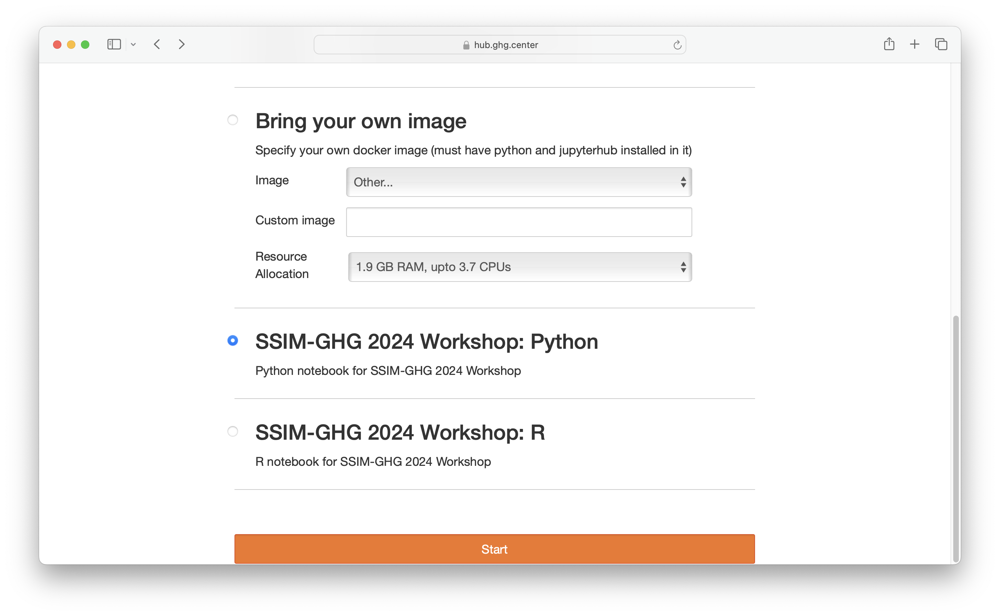

The Cooperative Institute for Research in the Atmosphere ([CIRA](https://www.cira.colostate.edu/)) is an interdisciplinary cooperation between NOAA research scientists and Colorado State University. CIRA is hosting a [summer school](https://www.cira.colostate.edu/conferences/rmtgw/) for inverse modeling of greenhouse gases using atmospheric data assimilation techniques. The [US Greenhouse Gas Center](https://earth.gov/ghgcenter) is supporting the workshop by providing 40+ attendees access to their interactive computing hub operated by 2i2c (see [our blog post about their launch](/blog/2023/us-ghg-center-launches/index)).

Hub administrators have [built a customized software environment](https://github.com/NASA-IMPACT/ssim-ghg-workshop-2024-python-image) with container technology for use at the workshop. In doing so, this bypasses the need for participants to individually install software on their own machines and the online hub provides a *consistent* and *reproducible* interactive computing environment that is easily *accessible* and *scalable*.

## Acknowledgements

2i2c would like to credit the following individuals for their great efforts supporting this workshop:

- Sanjay Bhangar ([Development seed](../../../collaborators/devseed/))
- Slesa Adhikari (NASA IMPACT)
