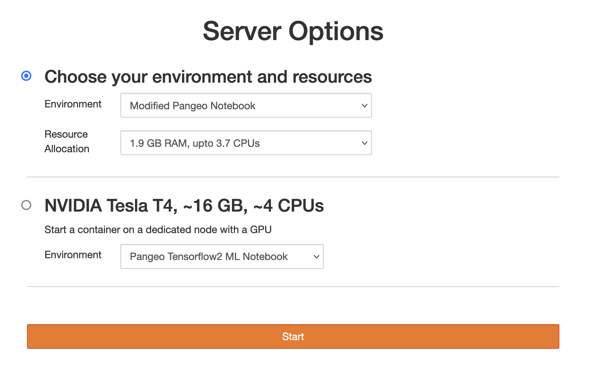
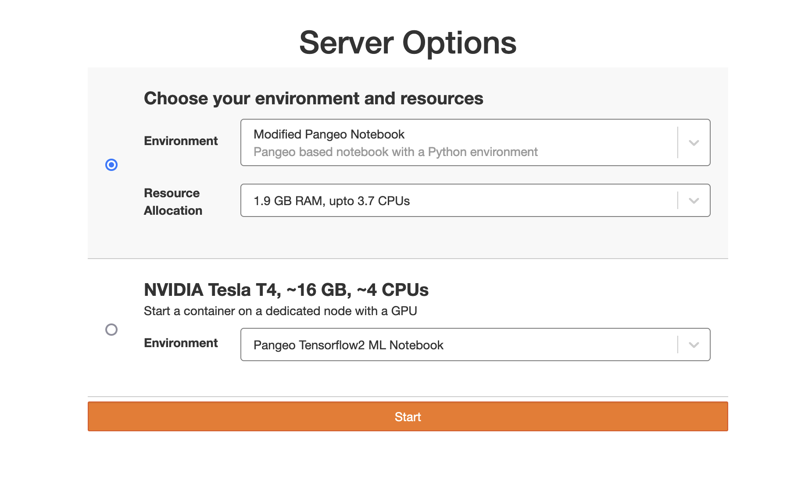
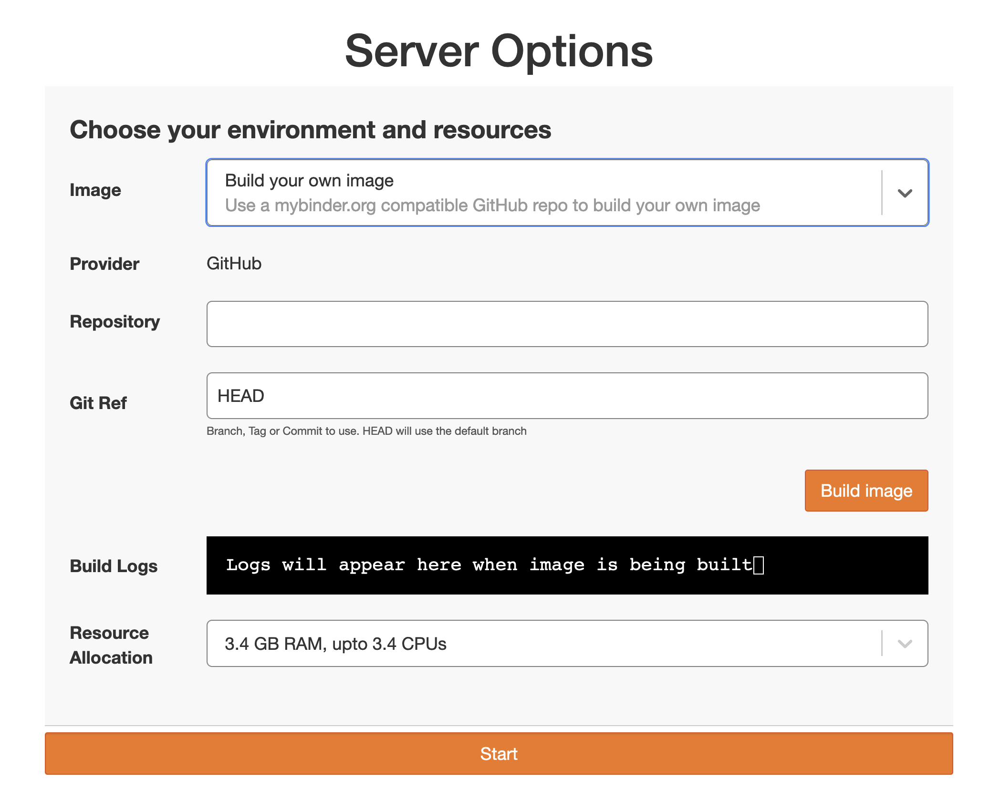

On most research oriented JupyterHub installations, users would like to customize their server (the environment, resources available, etc) after logging in. In Kubernetes based JupyterHub environments, a [profile list](https://z2jh.jupyter.org/en/latest/jupyterhub/customizing/user-environment.html#using-multiple-profiles-to-let-users-select-their-environment) provides this functionality.

(Profile List for the NASA VEDA JupyterHub with the default implementation from KubeSpawner)

The profile list is the de-facto "logged in homepage" for these users, as that is what they see after they have logged in.

In collaboration with [Development Seed](https://developmentseed.org/), funded by our [earlier grant](https://2i2c.org/blog/2024/jupyterhub-binderhub-gesis/) from [GESIS](https://www.gesis.org/home) as well as the [NASA VEDA project](https://www.earthdata.nasa.gov/data/tools/veda), we have been building the [`jupyterhub-fancy-profiles`](https://github.com/2i2c-org/jupyterhub-fancy-profiles) project to improve this experience.

(Profile List for the NASA VEDA JupyterHub with `jupyterhub-fancy-profiles`)

Last week, we rolled this new experience out to all 2i2c managed JupyterHubs! Here's a quick rundown of what this enables:

1. Descriptions for choices in the dropdowns, making it much easier for users to know what they are getting with each environment (or resource selection).
2. Fully backwards compatible with the existing KubeSpawner profile list implementation. In our PR to [roll this out](https://github.com/2i2c-org/infrastructure/pull/5083) to all hubs, you notice that we didn't have to change the structure of any profile lists! So you can safely roll this out to your hubs too without needing to fundamentally change how your profiles are set up.
3. It is a modern web app (built with [react](https://react.dev/)), just like the JupyterHub admin panel. This allows us to evolve and satisfy user needs much faster, as well as expanding the pool of people who can contribute to the project!
4. Support for dynamically building images using [mybinder.org](https://mybinder.org) style repositories! It talks to the [binderhub](https://github.com/jupyterhub/binderhub/) API so users can build reproducible environments as they wish without admin involvement nor needing to fully understand how docker and containers work. Our [earlier blog post](https://2i2c.org/blog/2024/jupyterhub-binderhub-gesis/) has more information.

   

This is just the start, and thanks to ongoing funding from the NASA VEDA project, we are going to continue making improvements to this experience.

## Use this in your JupyterHub

As with everything we build at 2i2c (per our [right to replicate](https://2i2c.org/right-to-replicate/) policy), this project can be used with *any* JupyterHub installation that uses Kubernetes. There are [instructions](https://github.com/2i2c-org/jupyterhub-fancy-profiles/?tab=readme-ov-file#how-to-use) in the README. Please try it out on yours and let us know what you think!

## Credit

- The project was initiated with funding generously provided by [GESIS](http://gesis.org) in cooperation with NFDI4DS (project number: [460234259](https://gepris.dfg.de/gepris/projekt/460234259?context=projekt&task=showDetail&id=460234259&)) and [CESSDA](https://www.cessda.eu) (see our [earlier blog post](https://2i2c.org/blog/2024/jupyterhub-binderhub-gesis/)).
- [Sanjay Bhangar](https://developmentseed.org/team/sanjay-bhangar/) and [Oliver Roick](https://oliverroick.net/) from [Development Seed](https://developmentseed.org/) for advocating for this project and contributing heavily to it.
- The [NASA VEDA](https://www.earthdata.nasa.gov/data/tools/veda) project, for continued funding (in the form of engineering time) plus being early adopters!