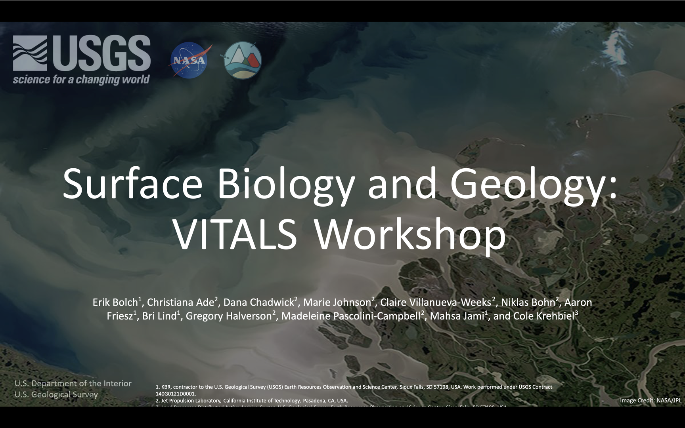

*Thanks to Brianna Lind, Julia Lowndes and Andy Teucher for contributing to this blog post!* 

[Openscapes](https://openscapes.org) is a value-based initiative that supports kinder, better science based on open source community. [NASA Openscapes](https://nasa-openscapes.github.io) is in its fourth year as a project supporting NASA Earth science in the Cloud, co-developed by Julia Lowndes (Openscapes) and Erin Robinson (Metadata Game Changers).  

The initiative recently supported the [Surface Biology and Geology: VITALS Workshop](https://nasa.github.io/VITALS/) hosted by NASA [Land Processes Distributed Activate Archive Center (LP DAAC)](https://lpdaac.usgs.gov/) and NASA [Jet Propulsion Laboratory (JPL)](https://www.jpl.nasa.gov/).

Instructors used the 2i2c Openscapes Hub to lead hands-on exercises teaching learners how to manipulate data collected from the [ECOSTRESS](https://ecostress.jpl.nasa.gov/) and [EMIT](https://earth.jpl.nasa.gov/emit/) instruments onboard the International Space Station. They used [Jupyter notebooks](https://nasa.github.io/VITALS/python/01_Finding_Concurrent_Data.html) in the Hub to demonstrate how open source tools together with cloud data and compute resources could effectively analyse the the Canopy Water Content and the Land Surface Temperature over the [Jack and Laura Dangermond Preserve](https://www.dangermondpreserve.org/), Santa Barbara, CA.

.")

This event was attended by around 250 participants. An event of this size therefore requires a *frictionless login flow* so that organizers could focus on the essential complexity of teaching data analysis rather than the accidental complexity of managing Hub authorization. GitHub authentication is the default option for most 2i2c Hubs for research use cases, but for an educational event of this size this option was not fit for purpose since organizers had to

1. Retrieve the GitHub usernames of each participant (assuming everyone was familiar with GitHub!)
1. Manually invite GitHub users to a GitHub organization to authorize access to the Hub (invitations would expire within seven days)
1. Repeat the above two steps last-minute for participants who showed up on the day without preparing
1. Manually remove GitHub users from the GitHub organization if they wanted to revoke access to the Hub after the event.

In response to this need, we developed a shared password feature so that workshop organizers can simply hand the share password out to learners for access to the Hub. This bypassed the manual labour of managing GitHub accounts while not adding to the learner's high cognitive load and improving the participant's learning experience overall.

One of the elements that enabled us to recognize and solve this issue effectively is our close partnership with the Openscapes team. We engage in regular [6-weekly catch-ups](https://github.com/NASA-Openscapes/2i2cAccessPolicies/issues/7) where we can learn about user requirements and how we can develop our infrastructure to co-create optimal solutions. Together with our [Product Delivery Flow](https://team-compass.2i2c.org/product/deliveryflow/#defining-our-product-delivery-flow), we were quickly able to architect the shared password solution in time for the workshop.

")

We have documented the technical infrastructure changes required to enable a shared password for the Hub in our [Infrastructure Guide](https://infrastructure.2i2c.org/hub-deployment-guide/configure-auth/shared-password/) and hope to support many future events with this mechanism!

## Acknowledgements

- [NASA Openscapes](https://nasa-openscapes.github.io/)
- [NASA LP DAAC](https://lpdaac.usgs.gov/)
- [NASA JPL](https://www.jpl.nasa.gov/)
- [NASA ROSES funding](https://science.nasa.gov/researchers/)
