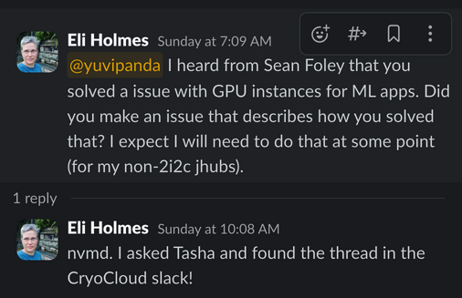

 Model inputs and (right, color) model outputs of a [simple multi-layer perceptron](https://pacehackweek.github.io/pace-2024/presentations/hackweek/ml_cloud_mask.html#a-simple-multi-layer-perceptron) for detecting cloud cover.")

[PACE](https://pace.gsfc.nasa.gov/) is the NASA Plankton, Aerosol, Cloud, ocean Ecosystem mission that focuses on understanding ocean health and its impact on the atmosphere. Together with the [Ocean Carbon and Biochemistry (OCB)](https://www.us-ocb.org/) program, a one-week [hackathon](https://pacehackweek.github.io/pace-2024/) ran from Aug 4 to Aug 8 on the 2i2c-hosted [CryoCloud](https://cryointhecloud.com/) hub. The goal of the hackathon was to explore new Earth science data streams provided by the [OCI](https://pace.oceansciences.org/oci.htm), [SPEXone](https://pace.oceansciences.org/spexone.htm) and [HARP2](https://pace.oceansciences.org/harp2.htm) instruments using Python.

## Machine Learning with GPUs

One of the most advanced tutorials delivered during the hackathon was the [Machine Learning Tutorial](https://pacehackweek.github.io/pace-2024/presentations/hackweek/ml_cloud_mask.html). The tutorial focused on creating a machine learning pipeline to detect cloud cover from satellite imagery. This was done by training a convolutional neural network (CNN) to assign each pixel a binary value to indicate whether the location was covered by cloud or not. To improve the spatial context beyond a single pixel value, as the likelihood of a pixel containing cloud cover increases if its neighbours also contain cloud cover, the CNN needs to be trained on the entire image at once rather than at a single pixel level. This massively increases the training time, but also allows the CNN to learn more complex relationships between pixels.

GPUs have a far greater number of cores than CPUs that are well-suited for accelerating the massive parallel processing needed to train a neural network on the large amounts of image data in the above scenario. [PyTorch](https://pytorch.org/) is a popular Python library for training CNNs, available for both CPUs and GPUs, and is an ideal tool for performing this kind of work. In terms of the accelerator hardware available on the CryoCloud hub, 2i2c provisions an instance with an [NVIDIA Tesla T4 GPU](https://www.nvidia.com/en-us/data-center/tesla-t4/) with 4 CPUS, 16GB of RAM and 2,560 CUDA cores.

## Managing shared memory on 2i2c hubs

While developing the above tutorial, tutorial lead Sean Foley (NASA/GSFC/SED & Morgan State University & GESTAR II) noticed that training neural networks was way slower than it should be given the GPUs available to them. They investigated the issue, and with help from the 2i2c engineering team, it was determined that shared memory was the issue. PyTorch uses shared memory via `/dev/shm` for faster parallel processing, and maximizing use of GPU. However in containerized environments, this is limited to a maximum of 64MB by default.

{}
You can check the amount of shared memory available on your hub in a terminal with the command

`df -h | grep /dev/shm`
{}

As you might expect, 64 MB of shared memory is not enough for training over 160,000 images in the tutorial. 2i2c was able to remove the limit, making `/dev/shm` share the memory the user has selected via their profile list, rather than be artificially limited to any particular size. This was done for _all_ users on the CryoCloud hub within an hour of the issue being reported and we upstreamed the change for _all_ 2i2c hubs (see GitHub pull requests for [CryoCloud](https://github.com/2i2c-org/infrastructure/pull/4564) and [all 2i2c hubs](https://github.com/2i2c-org/infrastructure/issues/4563)).

## Conclusion

This event demonstrates the economy of how running shared and open infrastructure dynamically solves problems for the benefit of many users, not just for one occasion. Learning experiences such as the above are transferred and embedded upstream into transparent and flexible open source software that impacts not only all users of 2i2c operated hubs, but also generalized for the wider research community at large (case in point, see the Slack thread below from [Eli Holmes](https://eeholmes.github.io/), operator of the [NOAA Fisheries](https://www.fisheries.noaa.gov/science-data/open-science-noaa-fisheries) hubs)! We are grateful for the strong partnerships with our communities who help us to co-design impactful solutions that are specific for their needs and accessible to all.

## References and Acknowledgments

- [Sean Foley](https://science.gsfc.nasa.gov/sci/bio/sean.r.foley) (NASA/GSFC/SED & Morgan State University & GESTAR II)
- [Tasha Snow](https://www.linkedin.com/in/tasha-snow-26815b23) (ESSIC UMD & NASA GSFC & [CryoCloud](https://cryointhecloud.com/))
- [PACE Hackweek Jupyter Book](https://pacehackweek.github.io/pace-2024/intro.html)
