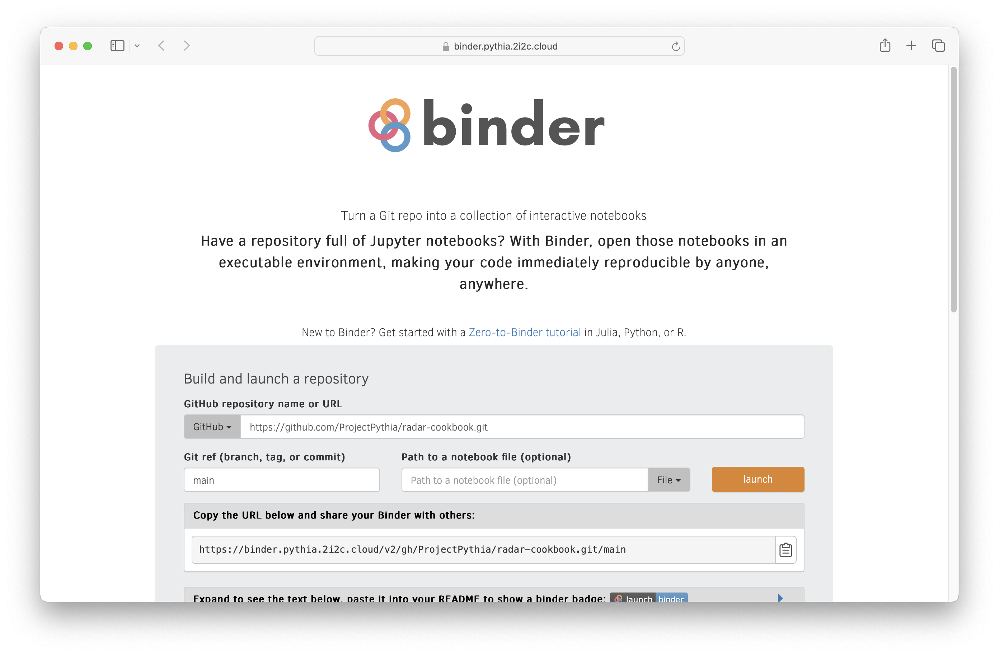
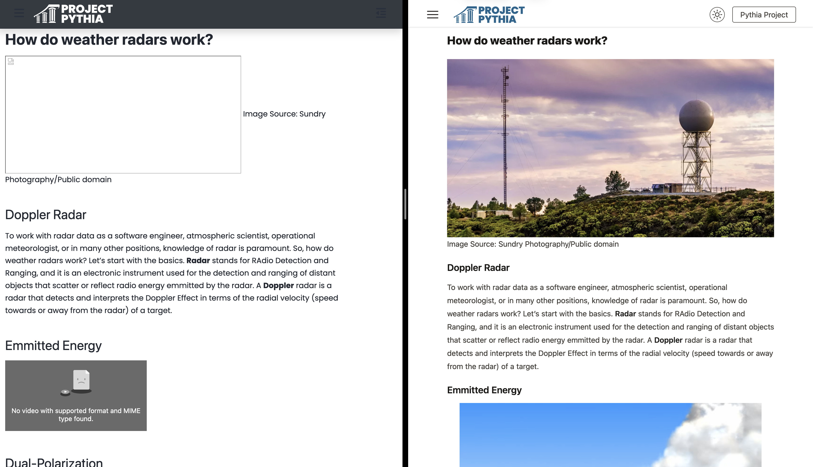

## What is Project Pythia?

[Project Pythia](https://projectpythia.org/) is the education working group for [Pangeo](https://pangeo.io/index.html), a community platform for Big Data geoscience in which 2i2c operates a cloud hub. The core aim of Project Pythia is to spearhead the creation and curation of community-driven, open-source documentation, in the form of "cookbooks", to enable the adoption of *open*, *scalable* and *reproducible* workflows for geoscientists.

## What did 2i2c do?

Jenny, James and Angus from the 2i2c team participated in the annual [Project Pythia Cook-off 2024](https://projectpythia.org/pythia-cookoff-2024/), a hackathon where cookbook authors and collaborators can spend dedicated time on creating and maintaining their content using [Jupyter Book](https://jupyterbook.org/en/stable/intro.html) and publishing their cookbooks with GitHub actions.

2i2c teamed up with the infrastructure breakout group during the hackathon, led by Katelyn FitzGerald (UCAR) and Kevin Tyle (University at Albany), and members of the [Curvenote](https://curvenote.com/) team also joined the group.

## Day 1

2i2c deployed and demonstrated a dedicated BinderHub service for Project Pythia that allowed hackathon participants to "self-serve" images of their software environment, which were specified by including a list of packages in an `environment.yml` file placed in their GitHub cookbook repository. Participants could then pull the image from a container registry into their 2i2c hub (or indeed, any other JupyterHub server) to share and reproduce their computational environments with ease.

## Day 2

During the first half of the day, we quickly identified a number of issues that were proving to be a maintenance headache for the Project Pythia infrastructure group:

- [ ] Configuration files for each cookbook were difficult to update at scale. Project Pythia currently have a gallery of over 30 cookbooks!
- [ ] Changes to Sphinx-based themes inherited from upstream were prone to breaking custom Project Pythia branding downstream.
- [ ] Executable content was not able to run on the Project Pythia's dedicated BinderHub hosted on [JetStream2](https://jetstream-cloud.org/index.html) (operated by NSF).
- [ ] Cookbooks frequently cross-referenced materials from other cookbooks to build upon pre-existing knowledge, but this was not easy to author and the reader experience was not as smooth as it could be.

Following the announcement that [Jupyter Book 2.0 will use MyST](../myst-jupyter-book/index) last month, Rowan (Curvenote) and Angus (2i2c) delivered a compelling demonstration of the [MyST](https://mystmd.org/) ecosystem centered around modern web-first technologies (JavaScript/TypeScript) that offers improved interactivity and accessibility.

In the second half of the day, we decided to use the hackathon to explore migrating the Pythia cookbooks from using a Sphinx-based to a MyST-based document structure and engine. Within one afternoon, the group migrated four cookbooks to use MyST MD

1. [Pythia Foundations](https://projectpythia-mystmd.github.io/pythia-foundations/)
1. [High Resolution Rapid Refresh on AWS](https://projectpythia-mystmd.github.io/HRRR-AWS-cookbook/)
1. [Radar Cookbook](https://projectpythia-mystmd.github.io/radar-cookbook/)
1. [Advanced Visualization](https://projectpythia-mystmd.github.io/advanced-viz-cookbook/).

This moment was palpably exciting! It was evident that MyST MD supported backwards compatible content out of the box, which alleviated fears of sunk cost into existing Sphinx-based cookbooks. The migration workflow was as simple as executing the following commands

`conda install mystmd`

`myst`.

## Day 3

We spent this day tackling support for managing a gallery of Project Pythia cookbooks at scale. See the Executable Books project blog post for technical details on how we

- [Centralized configuration](https://github.com/projectpythia-mystmd/pythia-config)
- Prototyped a [gallery](https://projectpythia-mystmd.github.io/) plugin in Python
- Fixed a number of bugs related to integrated computation with [Binder](https://mystmd.org/guide/integrating-jupyter#connecting-to-a-binder) and [JupyterLite](https://mystmd.org/guide/integrating-jupyter#jupyterlite)
- Embraced the referencing and reuse of content with [simple markdown syntax for hover-references](https://mystmd.org/guide/external-references#tbl-syntax-xref).



## Day 4

Looking to the future, we spent time reflecting on our experiences and discussing the potential, transformative impact MyST MD tooling could have in the hands of the scientific community at large, including the communities served by 2i2c. Knowledge-sharing based on static figures and PDFs would fall obsolete and give way to a dynamic, web-first approach to interactive communication and publishing backed by compute from a Jupyter server.

Throughout the course of the hackathon, the rate of iterated development for both end users of the community cookbook and the developers of the open-source tooling was astounding. For example, we were able to quickly expose small bugs ([e.g. support for HTML video tags](https://github.com/executablebooks/mystmd/issues/1297)) in the MyST MD tooling, which were immediately fixed upstream and released within minutes. The feedback loop that connected the user experience with the software tooling was incredibly synergistic, with immediate impact both upstream and downstream that 2i2c hopes to continue replicating across many facets of their operations.

Beyond the Project Pythia Cook-off, the breakout group will continue conversations around strengthening their community of practice and hopefully advocating for wider adoption of MyST MD amongst the scientific community (say hello to some of our group members at [SciPy 2024](https://www.scipy2024.scipy.org/) in July!).

## Acknowledgements

- University at Albany (NSF award 2324302): Led the funding acquisition, helped organize and facilitate the event
- UCAR (NSF award 2324303): Led the planning and logistics for the event
- 2i2c / Code for Science and Society (NSF award 2324304): Provided tailored compute services and on-site support
- Curvenote: Contributed engineering cycles to MyST MD development.
