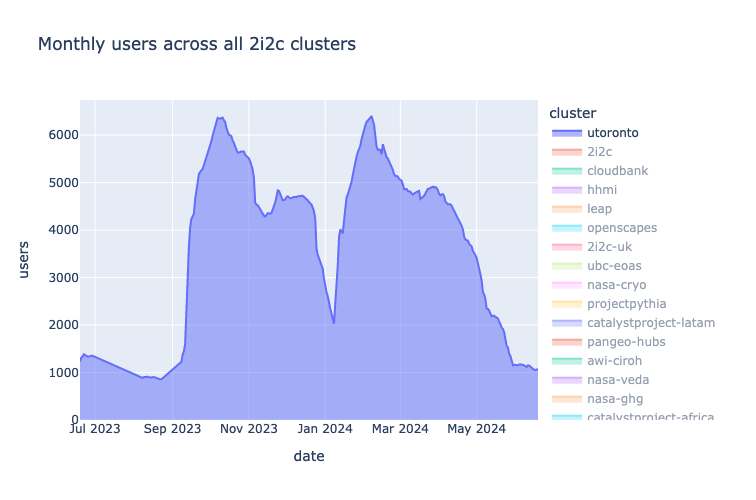

2i2c has operated The University of Toronto hub since 2021 and this hub supports over 6000 educators and learners in a day! With a community of this size, file storage can quickly grow out of control and cause issues.

The 2i2c engineering team have implemented a [low storage alerting system](https://github.com/2i2c-org/infrastructure/issues/3320) for Microsoft Azure, so that they can pre-emptively take remedial action before the filesystem is about to run out of diskspace.

Great job team 🚀

