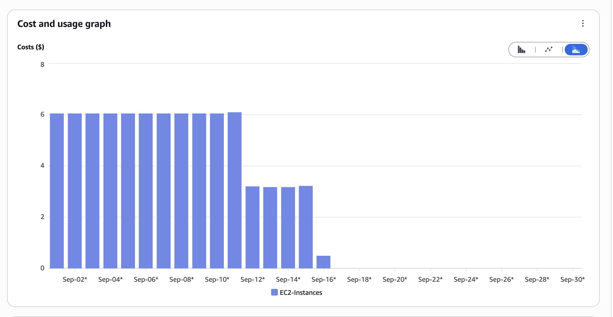

We've been working to reduce the base costs of running our cloud infrastructure on AWS by switching to more efficient instance types for our core nodes. This is the core infrastructure we use to ensure hubs are "always available" for users, even when no one is actively using a hub. By moving from older `r5.xlarge` instances to newer, more efficient `r8i-flex.large` instances, we've significantly reduced these baseline costs while maintaining the same level of service. Here's a plot of daily savings for the [GeoJupyter community](../../collaborators/geojupyter/).

The graph above shows the impact on EC2 node costs specifically (this doesn't include the entire cost of always-on infrastructure, but represents a significant portion). We are rolling out this change to all _new_ clusters, and starting to work through our pre-existing AWS clusters.

## Learn more

- [Pull request implementing the instance type changes](https://github.com/2i2c-org/infrastructure/pull/6721)
- [Our rollout plan for existing clusters](https://github.com/2i2c-org/infrastructure/issues/6756)
