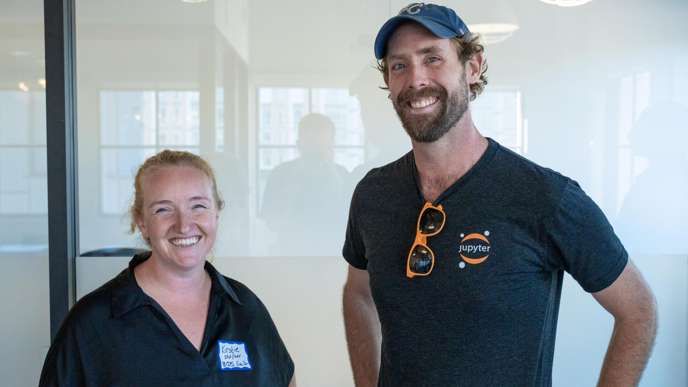

We're thrilled to announce that the [Berkeley Institute for Data Science (BIDS)](/collaborators/bids/) has joined as 2i2c's first premier member organization! This partnership marks a significant milestone in our sustainability strategy and recognizes a relationship that's been central to 2i2c's story from the very beginning.

*BIDS Executive Director Kirstie Whitaker and 2i2c Executive Director Chris Holdgraf discuss the partnership at the [membership launch event](../bids-premier-membership-event/).*

## What this partnership means

BIDS will act as a **lighthouse collaborator**, helping us design our member network services and relationships. This gives us a foundation for both technical and social collaboration, and we hope it opens doors to deeper partnerships across the Berkeley community.

{}
Berkeley has long been a leader in open source software development. This partnership lets us share our knowledge and support community development of open source infrastructure across institutions.
{}

## Why we're excited about this

**For open source:** [BIDS](/collaborators/bids/) has been a leader in supporting open source and cross-disciplinary open science for many years—contributing to projects like NumPy, scikit-image, NetworkX, and [JupyterHub](/collaborators/jupyterhub/). Their feedback and partnership will help us improve our impact across the entire ecosystem.

**For sustainability:** This is the first member of our new [membership model](../../../join/), which is a key part of our long-term sustainability strategy. It demonstrates that organizations value what we're building and want to invest in shared open source infrastructure.

**For 2i2c:** [BIDS](/collaborators/bids/) has been part of our story from the beginning, and this partnership recognizes the continuing influence and support we've received from the organization.

## Learn more

Read the full announcements from our partners:
- 👉 [CDSS press release: Berkeley Institute for Data Science Partners with 2i2c](https://cdss.berkeley.edu/news/berkeley-institute-data-science-partners-2i2c-open-source-infrastructure)
- 👉 [BIDS press release: Shaping the Future of Open Source: 2i2c and BIDS](https://bids.berkeley.edu/news/shaping-future-open-source-2i2c-and-bids)

## Acknowledgements

- The [Berkeley Institute for Data Science](/collaborators/bids/) and the entire BIDS team
- [UC Berkeley's College of Computing, Data Science, and Society](https://cdss.berkeley.edu/)
