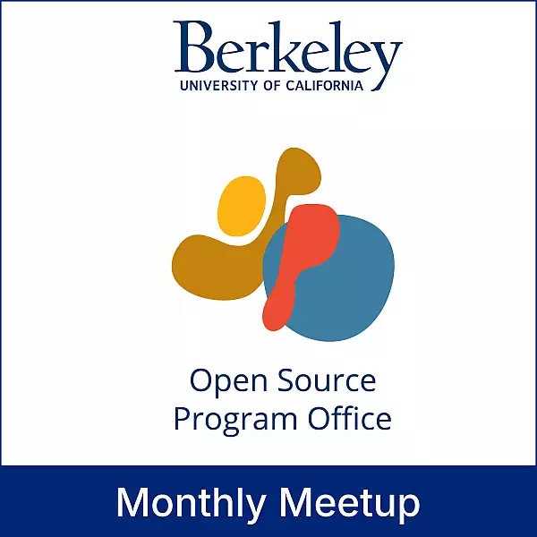

We're celebrating [BIDS (the Berkeley Institute for Data Science)](../../../collaborators/bids/) as 2i2c's first premier member at an event at UC Berkeley on **Thursday, October 15th**. If you're in the Berkeley area, we'd love for you to join us! [Event page here](https://events.berkeley.edu/BIDS/event/306419-ospo-monthly-meetup-launching-the-bids-membership-of-).

This is a milestone for 2i2c and demonstrates BIDS's commitment to open infrastructure and partnership. As our first premier member under our [new membership model](../../../join/), BIDS is helping us build a more sustainable path forward while strengthening our collaboration for shared impact in open science.

## Learn more

- [Event page and registration](https://events.berkeley.edu/BIDS/event/306419-ospo-monthly-meetup-launching-the-bids-membership-of-)
- [LinkedIn announcement](https://www.linkedin.com/feed/update/urn:li:activity:7381377448354988032)
- [Bluesky announcement](https://bsky.app/profile/ucbids.bsky.social/post/3m2mnocu2wc2m)
- [Our membership tiers and information page](../../../join/)
- [Other collaborators in our network](../../../collaborators/_index.md)

## Acknowledgements

- Thanks to [The Navigation Fund](../../../collaborators/navigation/) for funding the strategic roles that have led to this new membership model.
