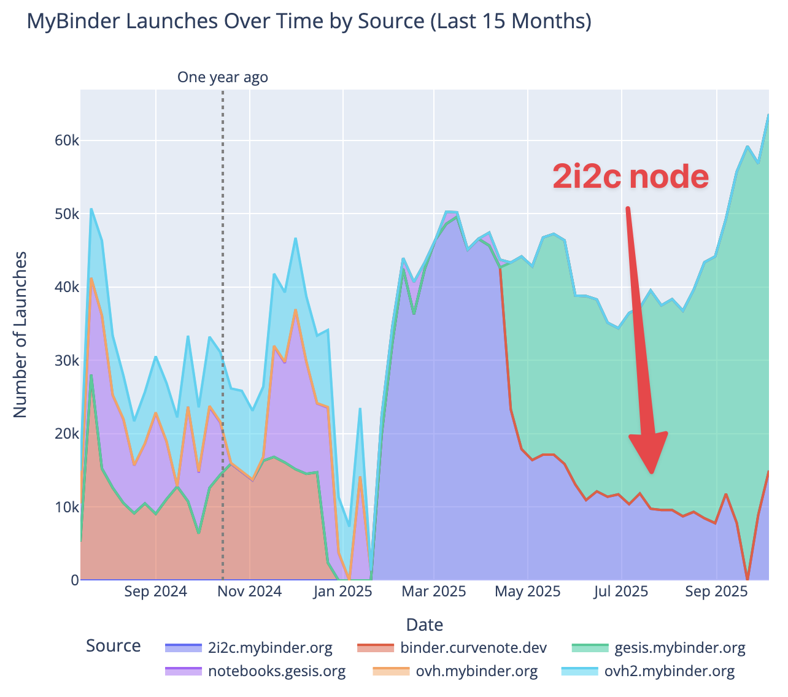

The [mybinder.org](https://mybinder.org) service provides reproducible and interactive computational environments for the open science community. It is financially supported by a [federation of BinderHubs](https://mybinder.readthedocs.io/en/latest/about/federation.html). 
2i2c is part of the team that manages mybinder.org, and we're committed to supporting this critical infrastructure for open science and reproducibility.

We developed a more [cost-efficient process for deploying BinderHub on a single VM](../binder-singlenode/) and are now running a BinderHub at [2i2c.mybinder.org](https://2i2c.mybinder.org).
This post highlights the impact we've had through our support of the mybinder.org federation, we'll update it periodically.

## Usage over time

*Here are weekly launches on mybinder.org. Launches from `2i2c.mybinder.org` are in red. Source: [mybinder analytics dashboard](https://hub.jupyter.org/binder-data/).*

**In Q1 of 2025**, `2i2c.mybinder.org` launched **417,048 reproducible sessions**. In this time, mybinder.org was primarily driven by our [new Hetzner node](../binder-singlenode/) as we worked with GESIS to stabilize their own BinderHub instance.

**In Q2 of 2025**, `2i2c.mybinder.org` launched **249,750 reproducible sessions**. In this time, we worked with [GESIS](../../../collaborators/gesis/) to deploy their BinderHub instance on the same Hetzner node setup, which let us distribute more of Binder's load onto them.

**In Q3 of 2025**, `2i2c.mybinder.org` launched **118,083 reproducible sessions**. We experienced a typical summer dip in sessions, had to [fix the analytics dashboard](../mybinder-analytics-fix/) as well as [fix a TCP scanning abuse case](../mybinder-antiabuse-scanning/) that briefly brought down the 2i2c node.

## Where we've made improvements

As part of this effort, we've made several improvements to the Binder and JupyterHub ecosystem. Here are a few links where you can read more:

- [Deploying BinderHub on a single VM with k3s](../binder-singlenode/) - Our approach to making BinderHub deployment cheaper and simpler
- [Hetzner cloud infrastructure experience](../jetstream-binderhub/) - Cost-effective cloud hosting for mybinder.org
- [Combating TCP scanning abuse on mybinder.org](../mybinder-antiabuse-scanning/) - Developing anti-abuse tools to prevent an abuse use-case.
- [Improving Binder's usage dashboard](https://hub.jupyter.org/binder-data/) - This helps us create posts like these and is useful to others as well.
- [Integrating BinderHub with JupyterHub](../../2024/jupyterhub-binderhub-gesis/) - Working with [GESIS](../../collaborators/gesis/) to bring Binder's dynamic image building capabilities to persistent JupyterHubs, empowering users to manage their own environments 

## Acknowledgements

This work is made possible by:

- [GESIS](../../collaborators/gesis/) for their continued support as mybinder.org federation members
- The [JupyterHub community](../../collaborators/jupyterhub/) for collaboration and support
- Our [member communities](/members/) whose fees support this work
