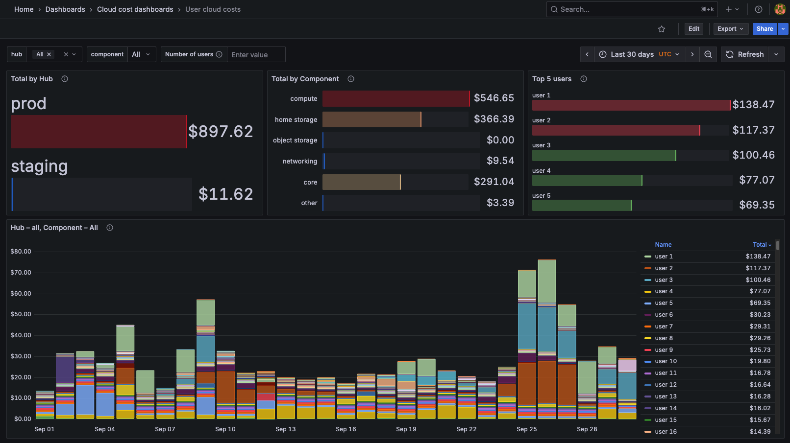

We've been working on new functionality that gives communities **dashboards to monitor their cloud usage and costs at a per-user level**. We're getting close to making this widely available for community hubs, and wanted to share a few dashboards for feedback.

A key goal of 2i2c is to make the cloud safe for science. By providing transparent cost monitoring, we give communities the confidence that they won't face unexpected bills and can better understand how their usage patterns translate to cloud costs. This visibility is especially valuable in our shared platform model, where each community gets their own independent hub while benefiting from shared infrastructure expertise.

The user-level cost breakdown allows communities to identify individual usage trends and manage their resources more effectively. Communities can now see exactly how their computational work translates to cloud spending, enabling better resource planning and budget management.

## Learn more

- [Pull request with implementation documentation](https://github.com/2i2c-org/docs/pull/269#pullrequestreview-3242224272)

## Acknowledgements

- [Development Seed](../../collaborators/devseed/) for working on this with us.
- [NASA VEDA](../../collaborators/nasa-veda/) for funding much of this work.
- [Openscapes](../../collaborators/openscapes/) and [Earthscope](../../collaborators/earthscope/) for giving us close feedback.