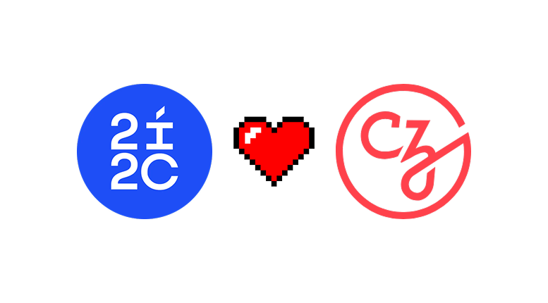
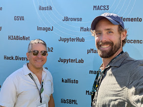

As I attend the [CZI Open Science](https://chanzuckerberg.com/science/programs-resources/open-science/) 2025 meeting, it’s a good moment to reflect on the many ways CZI has positively impacted both 2i2c and the Jupyter Project.

The funders who support organizations like 2i2c and Jupyter have a difficult task. In the day-to-day work of building open infrastructure, it’s easy to focus on the next challenge or grant, and lose sight of the cumulative, long-term impact of strategic support. This post is an attempt to pause and celebrate that impact.

CZI has played a unique role in the open source and open science ecosystem since its creation. It has taken an approach to funding and coalition-building that has genuinely changed how many think about supporting open source. Their model has driven an incredible amount of impact, and I'm very grateful for our collaboration.

Here are a few ways their support has stood out.

_This was collected quickly, so please let us know of other ways we may have missed! And most importantly, we're only trying to gather a high level view here, so we're including many efforts where all the work was led by teams and organizations *other* than 2i2c/Jupyter. The [Jupyter Community](https://jupyter.org) has many leaders that are part of this effort as well._

## Strengthening the foundations of Jupyter

Through its Essential Open Source Software for Science (EOSS) program, CZI has funded several initiatives in the [Jupyter ecosystem](https://jupyter.org) that have strengthened the project in foundational ways. Here are a few that stand out:

**JupyterHub's Contributor in Residence:** Allowed JupyterHub to [explore a new maintenance and community support model](https://blog.jupyter.org/lessons-learned-from-jupyters-contributor-in-residence-pilot-427e2b361a7b) and support maintainer growth. Georgiana's journey from this program to becoming 2i2c's first engineer shows how CZI's investment in people creates lasting impact.

**Community Strategic Lead:** Focused on [diversity, equity, and inclusion at a strategic level](https://chanzuckerberg.com/eoss/proposals/jupyterhub-community-strategic-lead/). This created space for us to rethink *how* we build our teams to be more accessible and equitable. It helped us create pathways for underrepresented groups to become community leaders and led to a key partnership with [The Turing Way](https://book.the-turing-way.org/).

**Real-Time Collaboration:** Built the foundation for [collaborative notebook editing](https://chanzuckerberg.com/eoss/proposals/real-time-collaboration-in-jupyter/), which is very useful for remote scientific collaboration. This was complex technical work that involved collaboration with many stakeholders. It laid a foundation that Jupyter continues to build upon, and may facilitate AI-based workflows in unexpected ways.

**Jupyter Accessibility:** Funded key improvements in [accessibility for JupyterLab and the broader Jupyter stack](https://jupyter-accessibility.readthedocs.io/en/latest/funding/czi-grant-roadmap.html), including WCAG compliance, automated testing, and documentation. This was one of the first times an open source community received significant support for accessibility and internationalization, highlighting CZI's leadership.

They also enabled a wide variety of contributions throughout the Jupyter ecosystem that can be traced back to the capacity that CZI's funding provided for core support alongside broader initiatives.

## Enabling 2i2c to grow from an idea to an organization

CZI also played a key role in 2i2c's birth, growth, direction, and impact. When 2i2c was only an idea, the possibily of initial support from CZI was pivotal in helping us turn it into a reality. Then as the organization took shape and started to grow, this support gave us the strategic capacity to develop key frameworks for [healthy open source contribution practices](../../2025/good-citizen/), [our value propositions](../../2024/value-proposition/), and ideas around [community network funding](../../2024/funding-community-networks/). It was a stepping stone towards building out our own [sustainability model via membership](https://2i2c.org/join).

Here are a few milestone moments:

**Our Seed funding (2020)** CZI provided core support to bootstrap 2i2c from its inception, funding organizational capacity rather than just technical deliverables. This was critical, enabling strategic partnerships, community coordination, and 2i2c's first hires (Georgiana Dolocan, formerly the CZI-funded [JupyterHub Contributor in Residence](https://blog.jupyter.org/the-jupyterhub-and-binder-contributor-in-residence-56708d1e3069), and Chris Holdgraf, 2i2c's Executive Director). This was the primary funding that drove our creation and operations for the first three years. We [published a comprehensive report and retrospective](https://2i2c.org/report-czi-2021) documenting the impact of this seed funding.

**Catalyzing Global Communities (2022)** This collaborative grant brought together six organizations (2i2c, The Carpentries, CSCCE, IOI, MetaDocencia, Open Life Science) to [provide cloud infrastructure and training for communities in Latin America and Africa](../../2022/czi-global-communities-proposal/). The project emphasized "train the trainers" approaches and community co-leadership. It was a much bigger challenge than we all realized, and the relationships between our organizations grew stronger as a result.

**Strategic Support for Sustainability (2024)** CZI provided a [bridge funding gift to sustain 2i2c's mission](../../2024/funding-czi/) during a critical growth phase. This gave us the runway to refine our service model and explore paths to financial sustainability. Combined with funding from [The Navigation Fund](../../2024/funding-navigation/), this gave 2i2c approximately two years for strategic planning.

### What Makes CZI's Approach Different?

Here are a few things that have stood out to me about CZI's unique approach to funding:

**Funding the foundation of open infrastructure:** Through its EOSS program, CZI recognized that science was building on open source infrastructure that was often under-supported. Explicitly targeting that foundation demonstrated the need to fund core technology, not just new innovation.  

**Funding communities, not just code:** CZI made efforts to support projects that invested in social infrastructure, recognizing that building open source is a deeply social process that needs social skills and capacity to succeed.  

**Funding connections in a network:** CZI took a network approach, actively building connections *between* its grantees. It flew us together annually for its open science meeting, made targeted efforts for collaborative grants, and connected grantees to work together.  

**Actively growing that network:** CZI made clear efforts to bring in new participants, particularly from communities in Latin America and Africa, and was thoughtful about respecting the agency and leadership of these communities.  

**Developing its own expertise and understanding:** CZI also *builds its own tooling*, often in partnership with open source projects. This gives its team empathy for our challenges and a deeper institutional understanding of the open source world, leading to more impactful contributions.

## Thank You, CZI

We're profoundly grateful to CZI for their support for 2i2c, Jupyter, and the broader open source ecosystem. Their investments have enabled Jupyter to serve millions of scientists more effectively, allowed 2i2c to grow from an idea to the organization it is today, and enabled contributions that benefit the entire open science ecosystem.

Thanks, CZI, for all the work you've done!
