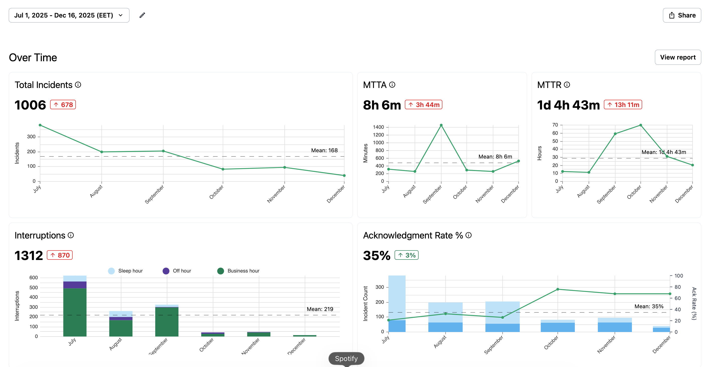

This year we've prioritized **making the cloud safe to try** for our member communities. This has driven work in monitoring, alerting, and automating infrastructure so that we resolve small problems before they become big problems. In the last quarter of 2025, we wrapped up this effort by testing the following hypothesis:

> We can reduce P1 incidents if we shorten the time to act on current alerts and learnings from prior incidents.

Here's what we accomplished and what we learned.

## What we accomplished

In short: we're now much more confident in the stability of community infrastructure.
Here's a snapshot of our new incident dashboard, which shows high-level trends for the stability of our infrastructure:

_See the real-time status of our community hubs at [status.2i2c.org](http://status.2i2c.org)_

### We improved infrastructure reliability for our communities

We made several technology and team process improvements that led to these benefits for our communities:

1. We are now more likely to catch outages before a community reports them to us.
2. We are now less likely to have an outage happen more than once, or affect more than one community, because we consistently fix the issues that cause outages.

We saw a consistent drop in critical alerts that required immediate response:

- For August and September we had an average of 7 outages/month (6 from alerts, 1 from community)
- In October, November, and December we had an average of 3 outages/month (9 in October, 0 in November, 1 in December, with only one of these being reported by a community)

### We became more efficient, responsive, and focused

We also got several team benefits from this work:

1. We get fewer interruptions and distractions from deeper work.
2. We have clear assignment policies to make it clear who is responsible for acting in response to alerts.
3. We avoid invisible work from falling down rabbit-holes when responding to outages.
4. We decreased the stress and pressure of doing upgrades, making them easier to split into sprint items and more likely to get done consistently.

## The improvements we made

### Infrastructure improvements

- Created a [status page for all 2i2c community hubs](http://status.2i2c.org), giving our team and communities visibility into the status of our infrastructure.
- Created an alert that triggers when two servers fail to start consecutively in a 30-minute time window.
- Improved deployment infrastructure so that we can roll out sub-chart upgrades to individual clusters, allowing us to roll out major changes in batches.
- Removed our "configurator" application from community hubs, because it was causing more confusion than it was resolving.
- Allowed servers to start even when users hit their storage quotas.
- Provided a number of upgrades to Kubernetes and the support services that we run alongside each community hub.

### Process improvements

- Made a team commitment to prioritize issues from [incident reports](https://2i2c.org/incident-reports) and other stability-related problems.
- Defined incident [escalation policies](https://infrastructure.2i2c.org/topic/monitoring-alerting/escalation-policies/) using the [status page](http://status.2i2c.org) to calibrate the urgency of our response to the severity of incidents.
- Defined "on-call" procedures so our team knows when and how to be more responsive to outages.
- Time-boxed our alert response process to avoid accidentally falling down rabbit holes for non-urgent problems.
- Created a more reliable process for [responding to incidents](https://infrastructure.2i2c.org/topic/monitoring-alerting/escalation-policies/) and writing [incident reports](https://2i2c.org/incident-reports).

## Looking forward

After this push around infrastructure reliability, we're significantly more confident in the stability and transparency of our community hub infrastructure. This will deliver better service for our member communities and free up more of our time to engage with them instead of fighting infrastructure fires.

We will continue to improve our infrastructure, and have a better foundation to do so incrementally in the coming quarters. Here are a few things we'd still like to improve:

1. We still need to improve how reliably we complete follow-up actions from incidents (e.g., writing incident reports). When a process doesn't fit into planning & scoping ceremonies, we struggle to follow it consistently.
2. We'd like to improve our testing framework for major upgrades across all hubs (e.g., Kubernetes version upgrades) to catch bugs before communities do.

## Learn More

- [2i2c Status Page](http://status.2i2c.org/)
- [On-call procedures documentation](https://infrastructure.2i2c.org/hub-deployment-guide/runbooks/on-call/)
- [Infrastructure repository](https://github.com/2i2c-org/infrastructure)
