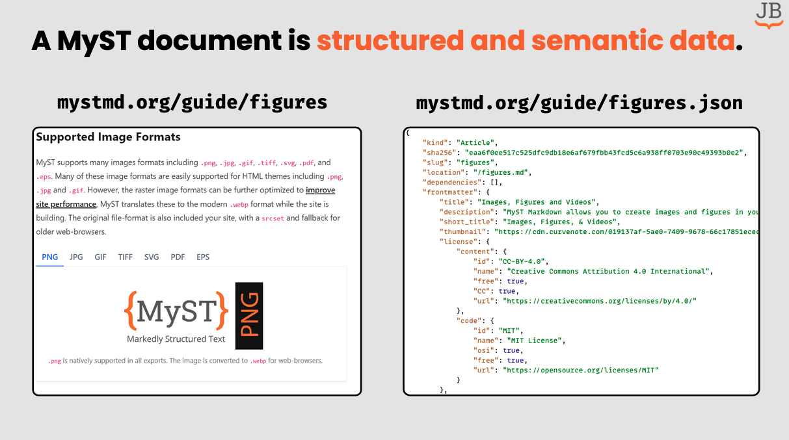

Chris gave a talk about Jupyter Book 2 and MyST at the [UC Berkeley Data Science Education Program](https://data.berkeley.edu/dsep)'s annual meeting. It covered the next direction for the Jupyter Book project, and its recent adoption of the [MyST Document Engine](https://mystmd.org) for Jupyter Book 2.

You can [view the full slide deck here](https://docs.google.com/presentation/d/1rHQudFtfk8ATu3Pmc1lFGDDAlCmAo8KGIk7ybTbTw6c/edit?slide=id.g2f14b3524cb_0_886#slide=id.g2f14b3524cb_0_886).

## Learn more

- [View the full slide deck](https://docs.google.com/presentation/d/1rHQudFtfk8ATu3Pmc1lFGDDAlCmAo8KGIk7ybTbTw6c/edit?slide=id.g2f14b3524cb_0_886#slide=id.g2f14b3524cb_0_886)
- [Learn about Jupyter Book 2](https://blog.jupyterbook.org/posts/2024-11-15-jupyter-book-2-alpha/)
- [See how we're using Jupyter Book for communities](../jb-for-communities/index.md)
- [Jupyter Book 2 documentation](https://next.jupyterbook.org/)

## Acknowledgements

- Thanks to [Project Pythia](../../../collaborators/pythia/) for funding some of our work on the Jupyter Book and MyST ecosystem
- Thanks to [CloudBank](../../../collaborators/cloudbank/) for collaborating with us on adapting and deploying Jupyter Book for education and organizing this summit
- Thanks to the [Jupyter Book project](../../../collaborators/jupyter-book/) for collaborating with us on these strategic efforts over the last years
