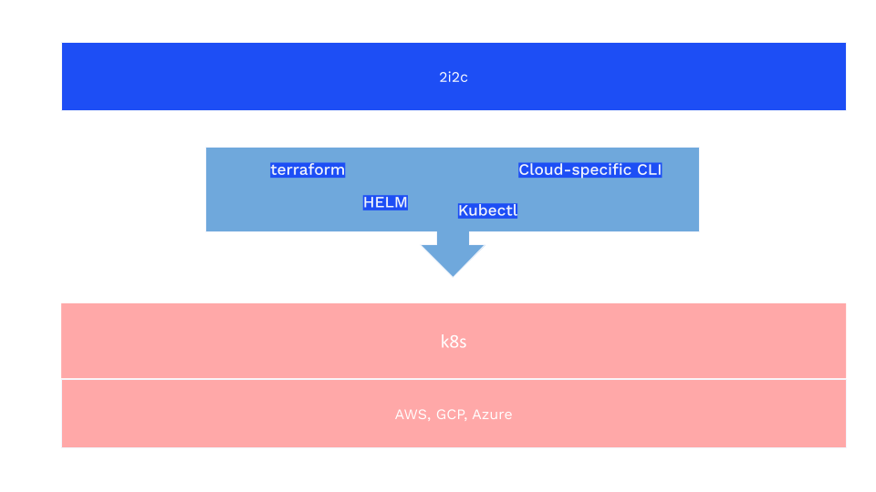
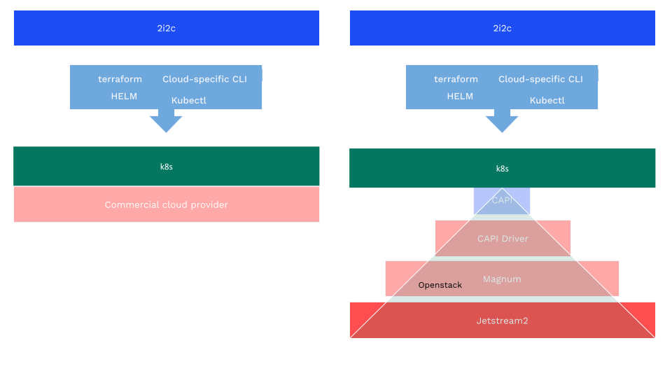

When we first committed to offer [Jetstream2](https://jetstream-cloud.org/index.html) support at 2i2c, Jetstream2, [Magnum](https://docs.openstack.org/magnum/latest/), [OpenStack](https://www.openstack.org/), [ClusterAPI](https://cluster-api.sigs.k8s.io/) were all new concepts that we hadn't used at 2i2c before.
And although the initial exercise of reading about each of them independently was confusing, learning how they actually glued together was the key.
This post is about Jetstream2, 2i2c persistent hub offerings, and the learning that took place in the process.

> ⭐ **Members of 2i2c's community network** can determine their eligibility and learn about JetStream2 in [our supported cloud providers documentation](https://docs.2i2c.org/about/distributions/#jetstream2). If needed, [reach out to 2i2c for support](https://docs.2i2c.org/support/).

## Context

At 2i2c, we want to be able to deploy k8s clusters on different cloud providers. In a very simplistic way, for this we use:

- `Infrastructure as code` to describe, deploy and manage the actual physical infrastructure from the cloud providers
- Cloud specific CLI to authenticate to this infrastructure
- [`Helm`](https://helm.sh/) to deploy and manage k8s resources onto this infrastructure
- And finally [`kubectl`](https://kubernetes.io/docs/reference/kubectl/) to interact with all of these k8s resources

(Main tools used at 2i2c to deploy and manage k8s clusters on different cloud providers)

On cloud providers like GCP, AWS, Azure, the Kubernetes support feels like an atomic feature of the cloud provider and works out of the box. But on Jetstream2, k8s support is not such a solid feature anymore.

## Jetstream2 Kubernetes support stack

Jetstream2 is a collection of supercomputers that are part of the [ACCESS cyberinfrastructure](https://access-ci.org/). This ACCESS infrastructure groups together super computers like Jetstream2 (but not limited to it), into a mesh that creates the impression of a single, virtual system that scientists can openly access and interactively use.

It offers Infrastructure as a Service (IaaS), that allows users to deploy VMs and manage environments dynamically. And the piece that enables this Infrastructure as a Service feature is OpenStack.

### OpenStack and Magnum

OpenStack is an open source platform made of multiple projects that help build and manage both private and public cloud infrastructure.

For our use-case, one of the most relevant OpenStack sub-project is Magnum. Magnum offers container orchestration engines for deploying and managing containers, like Kubernetes, but not limited to it.

Initially, Kubernetes support was provided through a project called [HEAT](https://wiki.openstack.org/wiki/Heat). However that has proven harder to manage and maintain, and it was extremely hard to upgrade a cluster. So, they’ve migrated towards a new driver called [Cluster API magnum driver](https://docs.openstack.org/magnum-capi-helm/latest/user_docs/index.html), which offers a more native k8s integration.

### Cluster API and CAPI helm driver
CAPI itself is k8s project that allows declaring k8s clusters in an easy way.

The helm driver on the other hand is what acts like a bridge between OpenStack’s Magnum and Kubernetes’ Cluster API (CAPI). Its main goal is to to manage the lifecycle (create, scale, upgrade, destroy) of Kubernetes-conformant clusters using a declarative API.

In order to do this, Cluster API provides an API for being able to manage the various components of a Kubernetes cluster. This conceptually looks like a Kubernetes cluster managing other Kubernetes clusters; the former, named the ‘CAPI management cluster’, is the one providing the API for managing the latter workload clusters.

### Decomposing the previous atomic feature

(Comparison between Jetstream2 and other cloud providers when it comes to k8s support)

Magnum is part of the OpenStack tent and it’s the first layer on top of Jetstream2 towards achieving k8s support.

The CAPI helm driver is what’s offering CAPI support. This is the last piece that’s needed to link a k8s cluster down to the hardware where it’s deployed, on Jetstream2.

## Challenges

The Jetstream2-OpenStack stack is not a simple one. It’s a complex stack of technologies and each of the connection points can be challenging to debug and fix when something doesn't work. Especially when you are one of the first ones that pilots this new magnum driver setup.

So, it was expected that we faced some issues along the way. However, we were able to go around them and add Jetstream2 to our service menu. Below is a list of some of the issues that we faced:

1. We have to create terraform resource in sequence which takes longer because of a race condition that makes concurrent nodegroups creation requests to fail
  - https://bugs.launchpad.net/magnum/+bug/2097946
2. The role and labels of the nodegroups don't get propagated to the actual nodes, so we cannot put our own labels on nodes at once
  - https://github.com/azimuth-cloud/capi-helm-charts/issues/84
3. The node count and min node count cannot be set to 0 and each nodegroup has to have at least 1 node
  - https://bugs.launchpad.net/magnum/+bug/2098002
4. A default-worker is created apart from the default-control plane nodegroup and we cannot delete it due to the same issue as in 2.
5. Latest CAPI helm chart version causes autoscaling to stop working in a persistent hub setup, so we had to downgrade it to a previous version
  - https://github.com/2i2c-org/infrastructure/issues/5601

## Conclusion

The biggest plus, is the people. We got support from [Julian Pistorius](https://github.com/julianpistorius), which has helped us a lot to both fix and validate some of the behaviours we were experiencing. Also, going through the [Jetstream2 support process](https://jetstream-cloud.org/contact/index.html) was also a pleasant experience because they were super prompt in answering and they were very nice.

Jetstream2 has a big plus over the other cloud providers with its openness thought the ACCESS program. This is something very handy to researchers and less costly than other cloud providers. 2i2c being able to offer hubs though this ACCESS program makes things more accessible to more researchers and more cost efficient. 

Higher complexity comes also with more control over the infrastructure which has its advantages.

Leaving the challenges apart, the experience was a nice one and the outcome was positive -> 2i2c is now able to deploy both mybinder.org-like hubs as well as persistent storage hubs on Jetstream2 hardware, from the same cloud-agnostic infrastructure.

## Acknowledgements

Thanks to [Project Pythia](../../../collaborators/pythia/) for funding and collaborating with us on this work.
