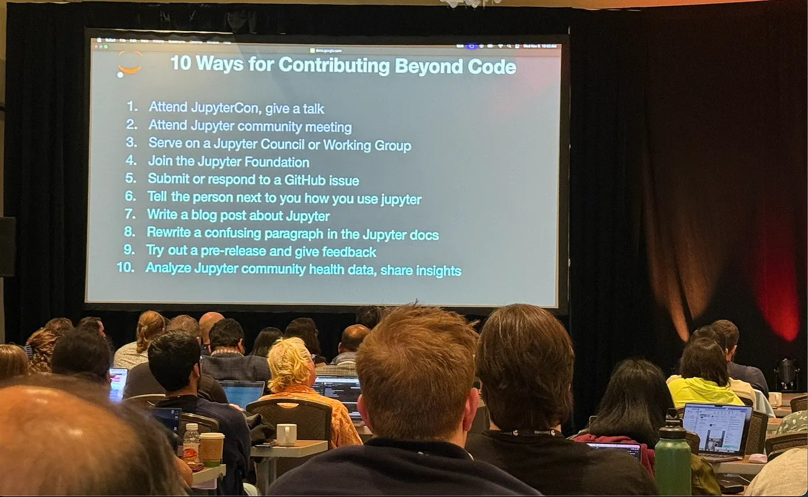

We spotted [a great post by Debisree Ray about JupyterCon 2025](https://medium.com/womenintechnology/reflections-from-jupytercon-2025-8ace9e6b27ab) on the [Women in Technology blog](https://medium.com/womenintechnology). It's full of thoughtful reflections about the community and the conference, and we wanted to share a few highlights.

*Image from [Debisree Ray's post](https://medium.com/womenintechnology/reflections-from-jupytercon-2025-8ace9e6b27ab)*

On the JupyterLab Extensions workshop:

> I chose to attend Developing JupyterLab Extensions, led by the Jupyter core contributors. It was one of the most practical, empowering workshops I've attended.

> Once you understand the architecture, building a JupyterLab extension feels less intimidating and more like unlocking a creative superpower.

On the community spirit:

> On the first day, while setting up my extension environment, I got stuck during execution — and before I knew it, several attendees (not just instructors!) jumped in to troubleshoot with me. That moment captured the true spirit of JupyterCon: a room full of brilliant people who genuinely want to help one another succeed.

> The openness, kindness, and inclusiveness of this community are unmatched. Everyone — from first-time contributors to long-time maintainers — collaborates with respect and a sense of curiosity.

On the Jupyter ecosystem's growth:

> Jupyter is no longer just about notebooks — it's powering AI workflows, enterprise analytics, and reproducible research pipelines at scale.

[Read the full post](https://medium.com/womenintechnology/reflections-from-jupytercon-2025-8ace9e6b27ab) for more about Debisree's week in San Diego, the community sprint, and other key takeaways.

## Acknowledgements

We didn't do any of the work in this post but do have some context from the Jupyter community that led to it being written and discovered, so here's a brief "thank you" nonetheless...

Thanks to [Debisree Ray](https://www.linkedin.com/in/debisree-ray-ph-d-82241355/) for writing such a thoughtful reflection and sharing it publicly. And thanks to [Matt Fisher from GeoJupyter](../../../collaborators/geojupyter/) for spotting the post and bringing it to our attention. Thanks also to [Rick Wagner](https://www.linkedin.com/in/rpwagner/) and [Jason Grout](https://www.linkedin.com/in/jason-grout/) for creating the slide as part of the executive council update.
