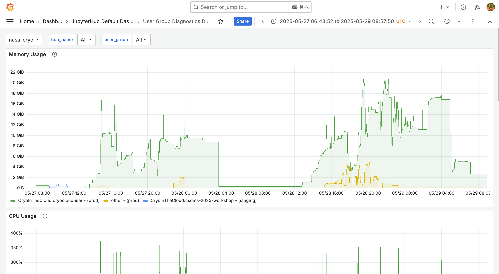

Managing user groups in JupyterHub can be a challenging task, especially in environments with dynamic user bases and complex group structures. This post describes how we can leverage the latest group management features in JupyterHub, along with Prometheus and Grafana, to monitor group-level resource usage effectively.

> ⭐ **Members of 2i2c's community network** can use this feature in their hubs by [following our cost attribution documentation](https://docs.2i2c.org/admin/monitoring/cost-users).



## Motivation

Hub admins have a strong impetus to monitor usage and costs by user groups
because it allows them to advocate for better funding and cost recovery models based on data-driven insights. Group-level resource monitoring can help them to answer questions like:

- How many people participated in our workshop group?
- How much GPU compute is our power user group using?
- Is our resource usage cost-effective for X group persona or Y group persona?

Current methods and workarounds include:

- ring-fencing resources for specific user groups personas, e.g. creating a separate hub for a workshop group, or creating a separate Dask cluster for a power user group, which increases the admin burden of managing multiple hub instances
- writing custom scripts to aggregate per user metrics, that are already available, into groups – which can be time-consuming and error-prone

## JupyterHub and user groups

Recent key developments upstream in JupyterHub for groups management, such as [Authenticator managed group membership](https://jupyterhub.readthedocs.io/en/latest/reference/authenticators.html#authenticator-managed-group-membership), makes this piece of work a prime and timely opportunity to be tackled. For more technical details of these upstream contributions, see GitHub PRs https://github.com/jupyterhub/oauthenticator/pull/735 and https://github.com/jupyterhub/oauthenticator/pull/498.

Users can access JupyterHub using a variety of authentication methods. Authentication providers like GitHub have built-in user management features that allow admins to create and manage user groups. These groups can then be configured in JupyterHub to authorize access to the hub, as well as control access to certain hardware profiles.

Following the key upstream contributions above, we can leverage [Authenticator-managed group membership](https://jupyterhub.readthedocs.io/en/stable/reference/authenticators.html#authenticator-managed-group-membership) to automatically pass user group memberships from the authentication layer to JupyterHub itself. This allows us to capitalize on JupyterHub's REST API to retrieve user group memberships from other [services](https://jupyterhub.readthedocs.io/en/latest/reference/services.html), such as exporting them as Prometheus metrics.

## Exporting user group memberships to Prometheus

The [`jupyterhub-groups-exporter`](https://github.com/2i2c-org/jupyterhub-groups-exporter) project provides a [service](https://jupyterhub.readthedocs.io/en/latest/reference/services.html) that integrates with JupyterHub to export user group memberships as Prometheus metrics. This component is readily deployable as part of any JupyterHub instance, such as a standalone deployment or a Zero to JupyterHub deployment on Kubernetes.

The exporter provides a [Gauge metric](https://prometheus.io/docs/concepts/metric_types/) called `jupyterhub_user_group_info`, which contain the following labels:

- `namespace` – the Kubernetes namespace where the JupyterHub is deployed
- `usergroup` –  the name of the user group
- `username` – the unescaped username of the user
- `username_escape` – the escaped username

Escaped usernames are useful because Kubernetes pods have characterset limits for valid pod label names (this limit does not apply to pod annotations). Storing both types of usernames allows us to join escaped versions with their more human-readable unescaped usernames.

Exposing this metric as an endpoint for Prometheus to scrape allows us to query and join groups data with a range of usage metrics to gain powerful group-level insights. Here is an example PromQL query that retrieves the memory usage by user group:

```promql
sum(
  container_memory_working_set_bytes{name!="", pod=~"jupyter-.*", namespace=~"$hub_name"}
    * on (namespace, pod) group_left(annotation_hub_jupyter_org_username, usergroup)
    group(
        kube_pod_annotations{namespace=~"$hub_name", annotation_hub_jupyter_org_username=~".*", pod=~"jupyter-.*"}
    ) by (pod, namespace, annotation_hub_jupyter_org_username)
    * on (namespace, annotation_hub_jupyter_org_username) group_left(usergroup)
    group(
      label_replace(jupyterhub_user_group_info{namespace=~"$hub_name", username=~".*", usergroup=~"$user_group"},
        "annotation_hub_jupyter_org_username", "$1", "username", "(.+)")
    ) by (annotation_hub_jupyter_org_username, usergroup, namespace)
) by (usergroup, namespace)
```

## Visualizing user group resource usage with Grafana

The PromQL query above is rather long and complex to construct! However, you can benefit from an [upstream contribution](https://github.com/jupyterhub/grafana-dashboards/pull/149) to the [jupyterhub/grafana-dashboards](https://github.com/jupyterhub/grafana-dashboards) project where we have encapsulated the PromQL queries as Jsonnet code and represented them as Grafana Dashboard visualizations (also known as [Grafonnet](https://grafana.github.io/grafonnet/index.html)). If you have a Kubernetes cluster running JupyterHub, try deploying these Grafana Dashboards and let us know what you think!

Our particular PromQL query above is visualized in the Grafana Dashboard **User Groups Diagnostics** under the **Memory Usage** panel (see also the corresponding screenshot at the top of this post). This is equivalent to its counterpart **User Diagnostics** dashboard, but with resource usage visualized on a *per-group* level rather than a per-user level :tada:

## Future work

We have laid the foundation for joining user group data to usage metrics with Prometheus by extracting memberships from JupyterHub's database. This unlocks potent ways in which observability systems can be extended to group-level reporting and monitoring.

Future directions for this work include:

- visualising cloud cost by user group in Grafana
- developing more group-level reporting and monitoring dashboards
- introducing group-level resource quotas.

What do you think? How would you like to see JupyterHub's group management features evolve? Have you tried deploying this yourself? [We welcome your feedback](https://docs.google.com/forms/d/e/1FAIpQLSff-u-sWFuwO1-VTgk2Ir7f1nfUUlLevQk_Vkk_jnmcI1nJnw/viewform?usp=header) and feel free to open GitHub issues or make contributions to the repositories mentioned in this post.

## Acknowledgements

Thanks to the [JupyterHub project](../../../collaborators/jupyterhub) for their collaboration and review of this work.