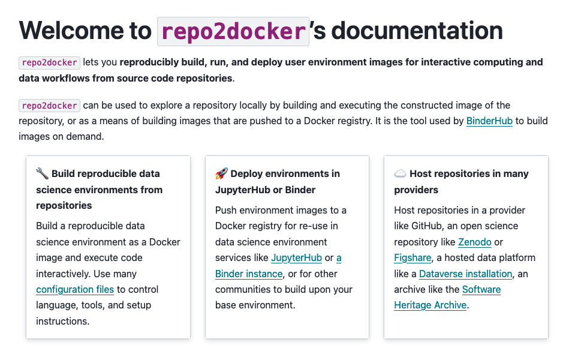

Documentation is incredibly important for open source projects to communicate their value and show users how to make the most of their tools. However, it's one of those things that often gets de-prioritized with all of the other work that needs to happen in a project.

We are heavy users of the [repo2docker project](https://repo2docker.readthedocs.io) in 2i2c's service. It allows you to dynamically build an environment image that can by hosted in a cloud service like JupyterHub. It's the underlying tool used by [BinderHub](https://binderhub.readthedocs.io), and is the focus of recent work on enabling [dynamic image building in a JupyterHub](../q1-product-goals/index.md) (more on that to come).

As part of this work, we decided to do a small [overhaul of repo2docker's documentation](https://github.com/jupyterhub/repo2docker/pull/1433), with the goal of making it easier to discover, navigate, and learn from. Here's how the landing page looks now!

We hope this makes repo2docker a more useful tool for everybody, and also gives us more confidence pointing our communities to the repo2docker documentation in their community workflows.

## Acknowledgements

- Thanks to the [NASA VEDA project](../../../collaborators/nasa-veda/) for providing funding and collaboration for this work.
- Thanks to the [JupyterHub community](../../../collaborators/jupyterhub/) for collaboration and review of this work.
