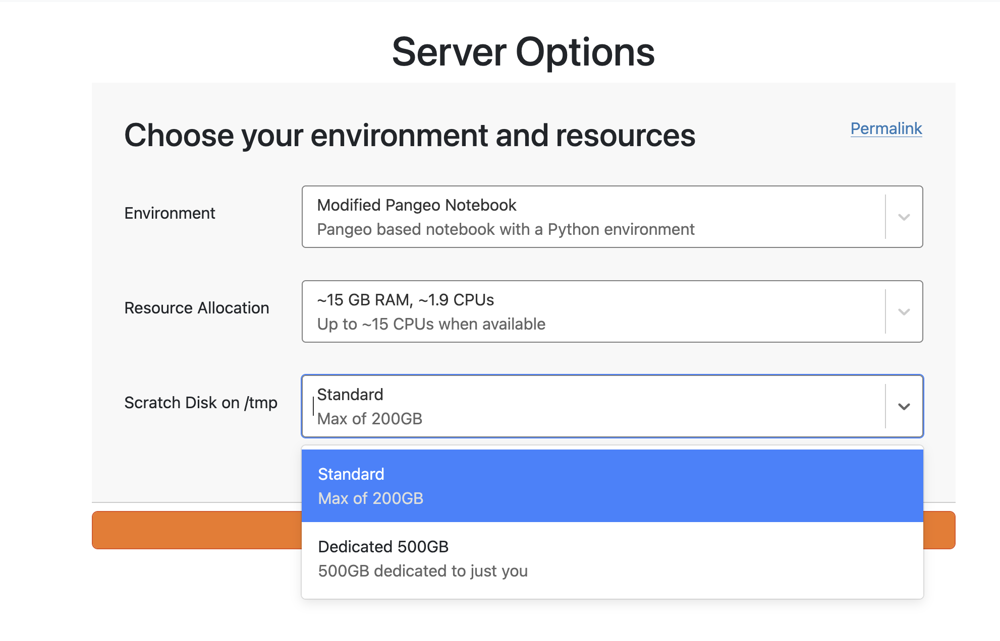

We recently figured out a simple way to give individual users their own `/tmp` folder so that they have more space in a cost-effective way.
`/tmp` is often used for storing intermediate data files and processing steps, but a few communities like [MAAP](../../../collaborators/nasa-veda) and [EarthScope](../../../collaborators/earthscope/) were running into size limits.
We could always increase the total size of the disk, but this increases a steady-state cost, ååwhich is overkill for something that is inherently ephemeral.
By using dedicated, temporary storage for the `/tmp` folder, we can make it more cost-effective to dynamically grow (and shrink) the space available to users.

*Choosing a dedicated `/tmp` disk on the MAAP staging hub.*

This builds on top of the [ephemeral volumes](https://kubernetes.io/docs/concepts/storage/ephemeral-volumes/) feature of Kubernetes, which our team recently discovered!
These attach a cloud disk to a single user's server, and Kubernetes deletes the disk when the server stops.

We built on the [JupyterHub Fancy Profiles](https://2i2c.org/jupyterhub-fancy-profiles/stable/) project to add a dropdown for users to pick a dedicated `/tmp` disk and how big they want it to be (see ths PR to learn more: https://github.com/2i2c-org/infrastructure/pull/9112).

## Learn more

- [User docs on dedicated `/tmp` disks](https://docs.2i2c.org/user/data/filesystem/#filesystem-tmp-dedicated)
- [Admin docs on dedicated `/tmp` disks](https://docs.2i2c.org/admin/monitoring/disk-usage/)
- [The initiative that asked for faster scratch space](https://github.com/2i2c-org/initiatives/issues/61)
