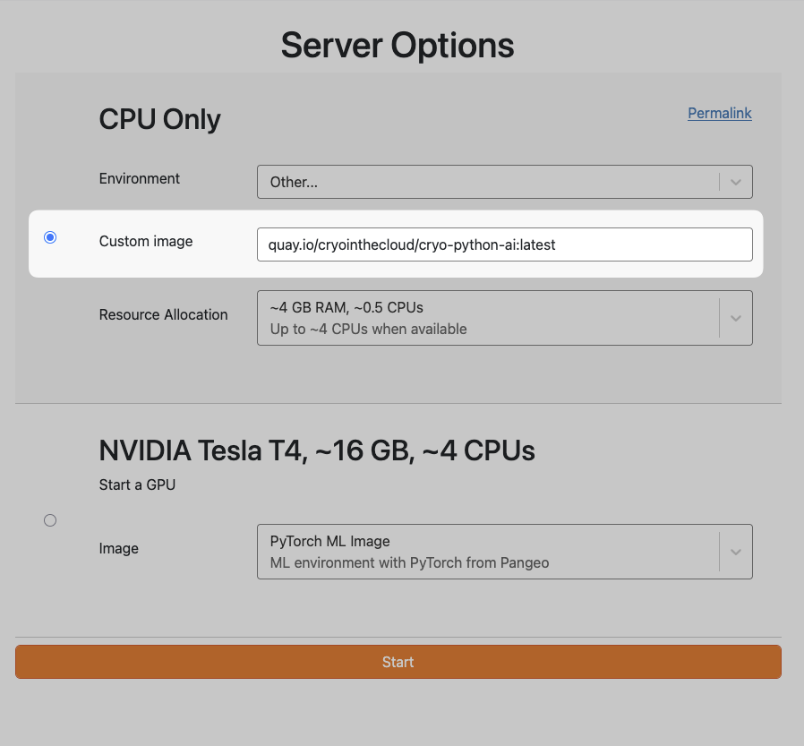

This summer, we participated in the [Responsible GenAI for NASA Earthdata workshop](https://responsible-genai.hackweek.io/), a community gathering to explore how others were using GenAI in their workflows across the NASA community, and share best practices.

As part of this work, we worked with [Tasha Snow](https://tsnow03.github.io/) to set up an environment on the [CryoCloud hub](../../../collaborators/cryocloud/) that allowed attendees to access and experiment with a few different LLM workflows with Earth data.

This is a short post to describe some of the decisions we made, how we set it up, and what we'd like to improve or do differently next time[^1].

_Setting up a hub environment for community LLM use is very much still a work in progress!
Don't treat it as a "best practices" post, more like a "here's one pattern to consider" post._

[^1]: Note: we already wrote up [some reflections from the workshop](../responsible-genai-workshop/index.md) that are more general. This one is focused on infrastructure and environment setup.

## Tools and services that hub users could access

Here's a quick description of what each user on the hub had access to:

- Two coding agents ready to use in the terminal: [Claude Code](https://github.com/anthropics/claude-code) and [opencode](https://opencode.ai).
- A pre-release of [Jupyter AI](https://github.com/jupyterlab/jupyter-ai) 3.2, for chatting with opencode inside JupyterLab (thanks to [David Qiu](https://github.com/dlqqq) for doing some rapid pre-releasing during the event!).
- Claude models, through a personal API key from UW eScience for each participant (using LLMoxie, more on this below).
- Open-weights models served by the [National Research Platform (NRP)](https://nrp.ai/documentation/userdocs/ai/llm-managed/) and preconfigured in opencode.
- The [`mothership` CLI](https://github.com/mikerjacobi/agent-workshop), for Mike Jacobi's [hands-on tutorial on agent sandboxing and evals](https://docs.google.com/presentation/d/16h45tch0_KpPrRXlw7DN618aXRRpjJ8edAzHiOy7SI0/edit).

## How the user environment was set up

The environment is a Docker image built from [`CryoInTheCloud/image-cryo-python-AI`](https://github.com/CryoInTheCloud/image-cryo-python-AI).[^tasha]

[^tasha]: If you'd rather build your own image from scratch, Tasha's [image template](https://github.com/tsnow03/BuildOwnImage_template_env) is a minimal starting point.

These two files do most of the setup for various LLM workflows:

- [`.binder/postBuild`](https://github.com/CryoInTheCloud/image-cryo-python-AI/blob/main/.binder/postBuild) installs Claude Code and the ACP bridge with `npm`.
- [`appendix`](https://github.com/CryoInTheCloud/image-cryo-python-AI/blob/main/appendix) installs opencode, the `gcloud` CLI, `mothership`, and the Jupyter AI pre-release.

We used [a GitHub Actions workflow](https://github.com/CryoInTheCloud/image-cryo-python-AI/blob/main/.github/workflows/build.yaml) to build the image and push it to a [Docker image registry](https://quay.io/repository/cryointhecloud/cryo-python-ai) so that it could be used by the hub.
We then asked users to specify this image when they launched their user sessions.[^access]

Throughout the workshop we made changes to [the repository that built this image](https://github.com/CryoInTheCloud/image-cryo-python-AI).
CI/CD jobs in a PR checked that each change built properly.
After merging the new image was automatically pushed to the registry so users got the changes when they re-launched their sessions.
For example, here's a [PR that upgraded Jupyter AI](https://github.com/CryoInTheCloud/image-cryo-python-AI/pull/15) in the middle of the workshop.

[^access]: We could have added this to the drop-down list of user environments, but opted not to because there were some security considerations that made us not want to unleash this image on everybody on the hub, just those at the workshop :-).

## How users accessed LLM models

There were two model inference services that we used.
Here's a quick breakdown of these, and how we gave users access to them.

### NRP

For the NRP models, we added a single API key to the hub (this didn't go through LLMoxie since the API keys were generated straight from NRP).[^bids]
[This pull request](https://github.com/2i2c-org/infrastructure/pull/8905) to [2i2c's infrastructure repository](https://github.com/2i2c-org/infrastructure/blob/main/config/clusters/nasa-cryo/prod.values.yaml) added two things to every user server:

- An `opencode.json` file that points opencode at NRP's inference endpoint and lists its models.
- The NRP API key, stored encrypted in the repository and exposed to users as the `OPENAI_API_KEY` environment variable.

This allowed the event participants to use NRP models without setting anything up themselves!

[^bids]: Both are adapted from the [BIDS demo hub](https://github.com/BIDS/hub-deploy/blob/2a0e060f930fe9ff7f2dc0e4a38ed9cb0dd791b4/hubs/demo/config.yaml#L257-L299), which is another good example to learn from.

### Claude

Each participant received an e-mail from the [UW eScience Institute](https://escience.washington.edu/) with their own API key for [UW SSEC's](https://uwssec.org) [LLMoxie AI Platform](https://github.com/uw-ssec/llmoxie).
This allowed the organizers to monitor the usage of each participant, control they could incur, and prevent participants from ever seeing raw API keys for Anthropic.
LLMoxie also adds a layer of security, since it can mask sensitive information in requests before they reach the model.
Model inference was provided through an allocation from [NSF CloudBank](https://www.cloudbank.org/).

On the hub, participants ran a small setup script from a shared folder that configured Claude Code to use the proxy with their key (see a [version of this script from UW](https://github.com/uw-escience-cloudbank/hub-image-jupyterai/blob/main/binder/setup-claude-cloudbank.py), and its [README](https://github.com/uw-escience-cloudbank/hub-image-jupyterai#claude-code) for more information).

## What we'd like to improve

Both approaches worked for a short workshop, but each has problems we'd want to fix before using them on a long-running hub.

- **The shared NRP key was visible to every user.** Anyone on the hub could read it from their environment, and potentially take it off the hub.
  This isn't a big deal for a workshop, since you can just recycle (or revoke) the keys once it's over, but it's a bigger risk for long-running infrastructure.
  It also meant we couldn't track any per-user or per-group usage, since it's just one token used by everybody.
- **The per-user Claude keys took manual work.** For Claude, we used the LLMoxie service, but this required a manual e-mail step + running a Python script on the hub to connect their local Claude Code to the LLMoxie service.
  _**Note**: Communities outside of UW can also request access to LLMoxie from [UW SSEC](https://uwssec.org)_.

We've written up [an initiative to improve this](https://github.com/2i2c-org/initiatives/issues/79)[^hub].
It is essentially a "credential proxy service" for JupyterHub that would connect to either LLMoxie or a per-cluster service like LLMoxie that we could run for communities.
It would allow communities to access inference servers using the authentication from their hub's user session, without needing to duplicate or expose API keys.
Let us know if this idea sounds useful!

[^hub]: There's actually already an [initiative in the JupyterHub roadmap](https://github.com/jupyterhub/roadmap/issues/13) for the hub proxy service as well!

Until then, beware if you follow a pattern like this for exposing an inference service API to your hub users!

## Acknowledgements

- Thanks to [Tasha Snow](https://tsnow03.github.io/) for pulling this together, to [David Qiu](https://github.com/dlqqq) for the Jupyter AI updates, to [Min RK](https://github.com/minrk) for the first LLM tooling, and to [Scott Henderson](https://github.com/scottyhq) and [Anshul Tambay](https://github.com/atambay37) for handling the Claude keys.
- Thanks to the [CryoCloud](../../../collaborators/cryocloud/) community for letting us experiment on their hub, and to NASA's [Office of Data Science and Informatics (ODSI)](https://www.nasa.gov/marshall/marshall-space-flight-missions/office-of-data-science-and-informatics-odsi/) and [Earth Science Data Systems (ESDS)](https://www.earthdata.nasa.gov/esds) program for supporting the workshop.
- Thanks to the [UW eScience Institute](https://escience.washington.edu/) for hosting the workshop and providing Claude access.
- Finally, much of the cloud and the LLM infrastructure was funded or operated by external sources: the [NRP](https://nrp.ai/) and [CloudBank](https://www.cloudbank.org/) are funded by the [National Science Foundation](https://www.nsf.gov/), and UW SSEC's [LLMoxie](https://github.com/uw-ssec/llmoxie) was developed with support from the NSF [NAIRR Pilot](https://nairrpilot.org/) and [Schmidt Sciences Virtual Institutes for Scientific Software](https://www.schmidtsciences.org/viss/) program.
