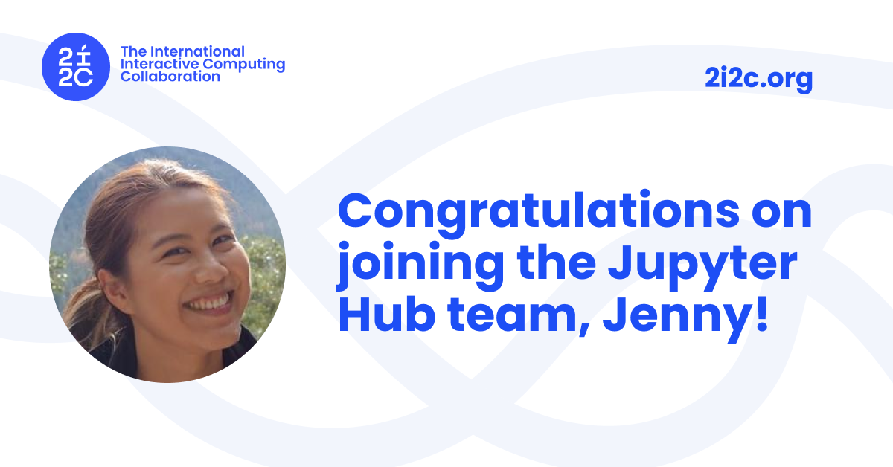

We're excited to share that [Jenny Wong](/author/jenny-wong) has been [invited to join the JupyterHub team](https://github.com/jupyterhub/team-compass/pull/876) as a contributor and maintainer.

Jenny's contributions to [nbgitpuller](https://github.com/jupyterhub/nbgitpuller) and [grafana-dashboards](https://github.com/jupyterhub/grafana-dashboards), along with her active participation in project meetings and community planning, earned her this recognition from the JupyterHub community. Being invited to a project team means that existing team members have recognized a pattern of high-quality contributions and trust in a person's ability to steward the project.

We're particularly excited about this because our mission isn't just about deploying infrastructure - it's about being [good citizens](../../2025/good-citizen/index.md) in the open source communities we depend on. We invest in upstream contributions, participate in community governance, and aim to build the kind of relationships that strengthen the whole ecosystem. When our team members are welcomed into upstream project teams, it's a signal that we're doing this well.

## Learn more

- [JupyterHub team compass](https://compass.hub.jupyter.org/en/latest/team/structure.html) - how the team is structured and how new members are added
- [JupyterHub proposal to add Jenny to the team](https://github.com/jupyterhub/team-compass/pull/876)
- [nbgitpuller](https://github.com/jupyterhub/nbgitpuller) and [grafana-dashboards](https://github.com/jupyterhub/grafana-dashboards) - projects Jenny contributes to

## Acknowledgements

- The [JupyterHub](../../../collaborators/jupyterhub/) community for fostering an open and welcoming project culture
- Support from our [member communities](../../../members/) gives us the capacity to invest in upstream open source engagement and build relationships like this
