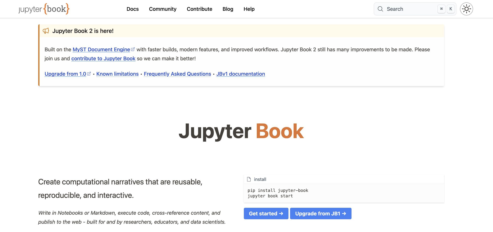

As part of [an initiative to improve jupyterbook.org's documentation](https://github.com/2i2c-org/initiatives/issues/28), we refactored the site so that multiple repositories are served under one domain. We wrote up the details on the [Jupyter Book blog](https://jupyterbook.org/blog).

Read the full post here:

[How we combine multiple repositories into one website at jupyterbook.org](https://jupyterbook.org/blog/posts/2026/multi-repo).

Along the way we made several upstream improvements to the [MyST Engine](https://mystmd.org) and the [MyST theme](https://github.com/jupyter-book/myst-theme):

- [`parts:` support for `extends:`](https://github.com/jupyter-book/mystmd/issues/2126) and [URL support as well](https://github.com/jupyter-book/mystmd/issues/2127) so we can share a footer / navbar configuration across repositories
- [`internal_domains` option](https://github.com/jupyter-book/myst-theme/pull/816) so that links to another repository's content could still be treated as internal
- [Less aggressive citation parsing](https://github.com/jupyter-book/mystmd/pull/2684) so that text like `@githubhandle` weren't parsed as a citation
- [Several mobile and UX fixes](https://github.com/jupyter-book/myst-theme/pull/790) (that's one, there were many others!)

- [Several mobile and UX fixes](https://github.com/jupyter-book/myst-theme/pull/790) (that's one, there were many others!)

These all felt particularly relevant for documentation that our [member communities](https://2i2c.org/members) manage, where you have content split across multiple repositories but served at a single domain.
## Acknowledgements

Thanks to [Project Pythia](/collaborators/pythia/) and [EarthScope](/collaborators/earthscope/) for collaboration and feedback that helped shape this work. And thanks to our [member communities](/members/) whose memberships fund upstream contributions like these.
