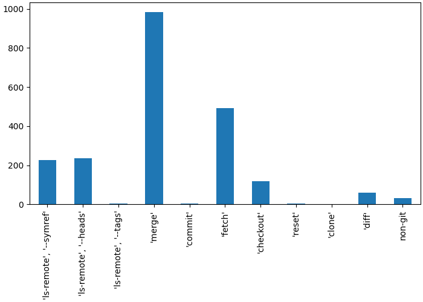
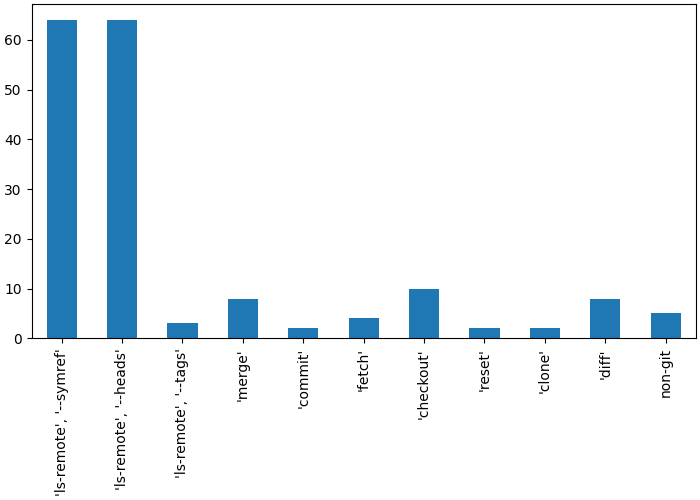
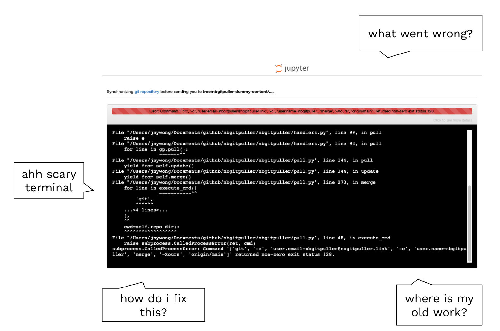
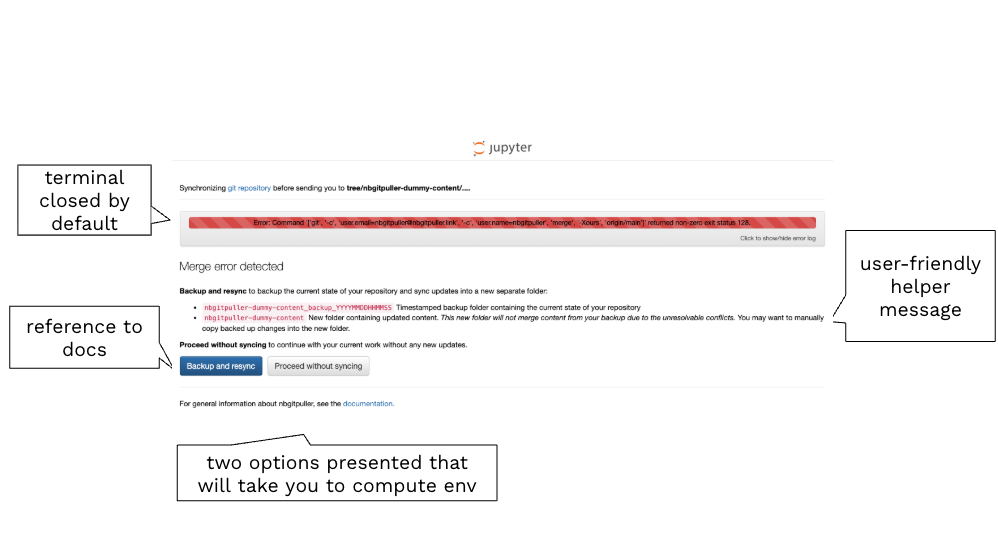

## TL;DR

[nbgitpuller](https://github.com/jupyterhub/nbgitpuller) now has improved UX context-aware error handling. Try it out and update to the latest version 🚀



## What is nbgitpullter?

[nbgitpuller](https://github.com/jupyterhub/nbgitpuller) is a way to sync *content* with *compute* through the click of a link. Example use cases include:

- [Spyglass](https://elifesciences.org/reviewed-preprints/108089) (HHMI)
- Workshops and training scenarios (Openscapes, Data8, …)
- Exams (UToronto, UCBerkeley DataHub, …)

In the case of [Spyglass](https://elifesciences.org/reviewed-preprints/108089), the *content* is [https://github.com/LorenFrankLab/spyglass-demo](https://github.com/LorenFrankLab/spyglass-demo) hosted on GitHub, the *compute* is a 2i2c cloud hub hosted at [https://spyglass.hhmi.2i2c.cloud](https://spyglass.hhmi.2i2c.cloud/), and by using the handy [nbgitpuller link generator](https://nbgitpuller.readthedocs.io/en/latest/link.html), you can generate [this nbgitpuller link](https://spyglass.hhmi.2i2c.cloud/hub/user-redirect/git-pull?repo=https%3A%2F%2Fgithub.com%2FLorenFrankLab%2Fspyglass-demo&urlpath=lab%2Ftree%2Fspyglass-demo%2Fnotebooks%2F00_HubQuickStart.ipynb&branch=main) to share with others to seamlessly explore content on the desired compute platform with the relevant data and toolchains installed.

## How does nbgitpuller work?

`nbgitpuller` is installed in the compute environment. The compute environment now has an `/git-pull` endpoint URL that can understand where to pull content from using URL parameters. Syncing content critically depends on `git` operations to `fetch`, `checkout`, `clone`, `merge`, `commit`, etc.

## When it goes wrong

Based on the data sent through by the kind folks running the Berkeley DataHub, there were 2163 logs available, of which:

- 983 (45%) were ‘merge’ conflicts
- 493 (23%) were ‘fetch’ errors
- 467 (22%) were ‘ls-remote’ errors

The remaining errors (10%) were mostly ‘checkout’ errors. This represents most **frequent** errors as seen by students.

In the same set of logs, there were 172 **unique** errors: most ‘ls-remote’ errors come from mistakes in the content repo URL. This represents most uniquely common errors made by instructors.

## Merge conflicts

If the link author changes content after the link consumer clicked a link, then `nbgitpuller` needs to sync updates for the consumer on subsequent link clicks. The `nbgitpuller` merging strategy makes opinionated choices so that the link consumer *never* has to interact with git, and will always preserve the consumer’s working changes.

Things can go wrong when

- Consumers can diverge the git history if they perform a git commit
- Authors can diverge the git history if they perform force push commits

## Error UX (old)

Problems with the old UX include:

- a scary terminal
- difficulty for the user to figure out what went wrong
- no suggestion for the user to fix the problem or signpost to continue to the compute platform

## Error UX (new)

New improvements to the UX include:

- terminal closed by default, but you can optionally toggle this open
- there is a copy to clipboard button to easily share the error log from the terminal
- more user-friendly and context aware helper message is displayed
- a link to the general documentation for reference
- in the case of merge errors, two button options are presented:
  - Backup and resync
  - Proceed without syncing

## Learn more

- [nbgitpuller documentation](https://nbgitpuller.readthedocs.io/en/latest/)
- [GitHub tracking issue](https://github.com/2i2c-org/infrastructure/issues/6442)

## Acknowledgements

- [UC Berkeley](https://www.berkeley.edu/) and the [CloudBank Classroom](https://www.cloudbank.org/training/access-cloudbank-classroom) project
- [Eric Van Dusen](https://github.com/ericvd-ucb) and [Sean Morris](https://github.com/sean-morris) were key champions of this work
- [CAL ICOR](https://www.cal-icor.org/) for co-funding
