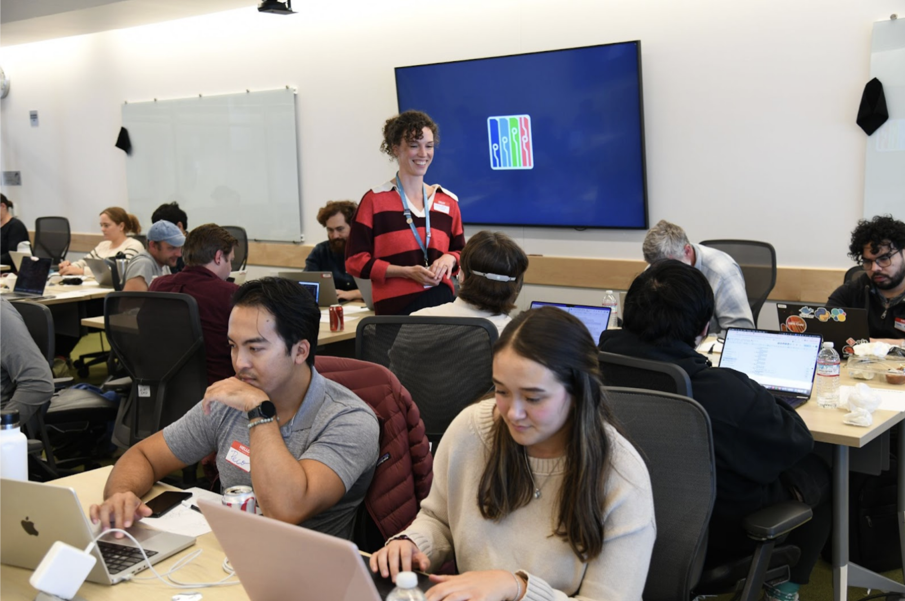

## What happened

The STRUDEL team hosted an all-day workshop with over thirty participants prototyping web applications using the [STRUDEL Design System](https://strudel.science/strudel-kit/docs/) and AI assistants in a custom hub environment designed and managed by 2i2c. By the end of the day, all of the participants had a working prototype that incorporated their own data (or dummy data) into complex flows facilitated by the STRUDEL Design System.

After a brief introduction to STRUDEL, participants were guided on setting up their personal coding environments using the STRUDEL Hub that 2i2c managed. The hub was configured to launch a unique code repository for each participant that was set up pre-workshop on the [strudel-workshops](https://github.com/strudel-workshops) GitHub organization.

> "Having a startup environment was very nice, as often getting a good development environment set up is half the battle for smaller projects."

The hub used [VS Code for the Web](https://code.visualstudio.com/docs/editor/vscode-web), pre-configured with the [Cline AI assistant extension](https://cline.bot/). Participants configured Cline with a shared API key generated by the STRUDEL team via [OpenRouter](https://openrouter.ai/). OpenRouter enabled the team to load credits into a shared account and API key that, in turn, enabled participants to use premium models inside of Cline.

> "Super easy to set up Cline in the VM, I appreciated that"

The day was split up into four sprints during which participants worked on different parts of their user interface application, with the majority of the participants working entirely in the 2i2c environment.

> "I just want to express my gratitude for such an awesome day today. The workshop was really well structured and facilitated, and I learned a lot. Thank you so much for letting me come!"

## Why we're excited about this

We think it's a great example of setting up a complex environment once, and then providing rapid access to these environments via a centralized hub.

This setup accelerated prototyping by removing the burden of setting up a development environment. The setup enabled participants, many of whom had never coded a web application or used an AI coding assistant before, to work seamlessly towards the goals of their design and development projects. The work they produced may continue beyond the workshop and have an impact on scientific discovery and operations.

This setup is a valuable mechanism for encouraging people to build within a pre-existing design system. Being able to launch repositories that are preconfigured with design system tools and templates is a powerful way to promote the adoption of a design system and its embedded patterns and best practices.

It's also an interesting example of **non-Jupyter interfaces** orchestrated on a JupyterHub.
The combination of VS Code for the Web, Cline, and OpenRouter represent a stack that can be easily transferable to other similar workshops.
OpenRouter enabled the workshop team to manage the costs of AI usage entirely themselves.

In all, the participants and instructors were allowed to focus on their work instead of managing and setting up their infrastructure.

## Links to learn more

- Learn more about the workshop on the STRUDEL website: https://strudel.science/engage/news/10-23-2025-building-scientific-uis-with-strudel-and-ai-assistants/
- Explore STRUDEL + AI assistant tips and tricks: https://github.com/strudel-science/strudel-kit/blob/main/docs/docs/usage-with-ai.md

## Acknowledgements

We would like to thank all workshop participants. [STRUDEL](../../../collaborators/strudel/) is an open source project housed at the Berkeley Institute for Data Science (BIDS) at the University of California, Berkeley. The STRUDEL team includes members of the Lawrence Berkeley National Lab Scientific Data (SciData) Division UX team, Superbloom Design, The Carpentries, and 2i2c. The project is generously funded by the Alfred P. Sloan Foundation, Liz Vu & Josh Greenberg Program Officers, grants G-2022-19360, G-2023-21098, and G-2024-22557.
