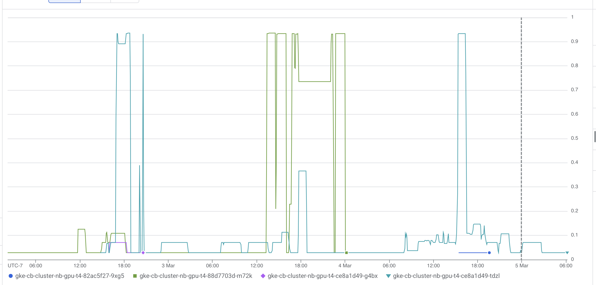
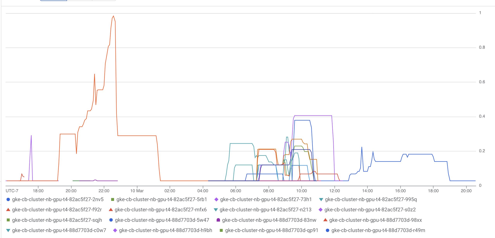

Things to convey:

1. We wanted to serve ~50 users on an intro to GPU computing workshop. Didn't need a lot of power, but needed GPU, not CPU. Don't want to spend a lot of money!
2. However, GPU resources are so constrained that GCP couldn't actually consistently provision for us 50 of the cheapest GPUs you can get today - NVIDIA T4s.
3. To run the workshop, we had to implement support for [GPU Timeslicing](https://docs.nvidia.com/datacenter/cloud-native/gpu-operator/latest/gpu-sharing.html), the only way to share a single GPU across multiple users on the cheapest GPUs.
4. We then measured the GPU usage of the workshop material, and determined that 2 users can be on one GPU without issue.

5. In actual usage, we found that the GPUs were even less heavily utilized than we expected - so we could have potentially put more users on fewer GPUs, for cheaper! However, since Timeslicing has *no* safeguards around one user stomping on another user's work, we want to be careful here to not overdo it.

6. Still a long way to go in making GPUs accessible where needed. But GPU Timeslicing lets you stretch cheap GPUs for a lot longer when handling introductory material.
7. Say something about how much $$$ it cost, for how many people.
8. Need someone to trial this for AWS

## Acknowledgements

- To Eric
- To Sean
- To April (for setting up our community meetings and strategy so we were able to serve them well)
- To Kirstie, for putting together a social event that encouraged ad-hoc information exchange that allowed us to serve Cloudbank Classroom better
- Support from our [member communities](../../../members/) gives us the capacity to invest in upstream open source engagement and build relationships like this
