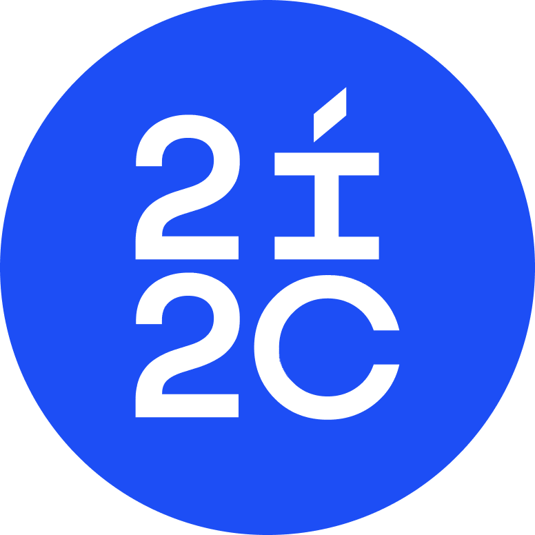
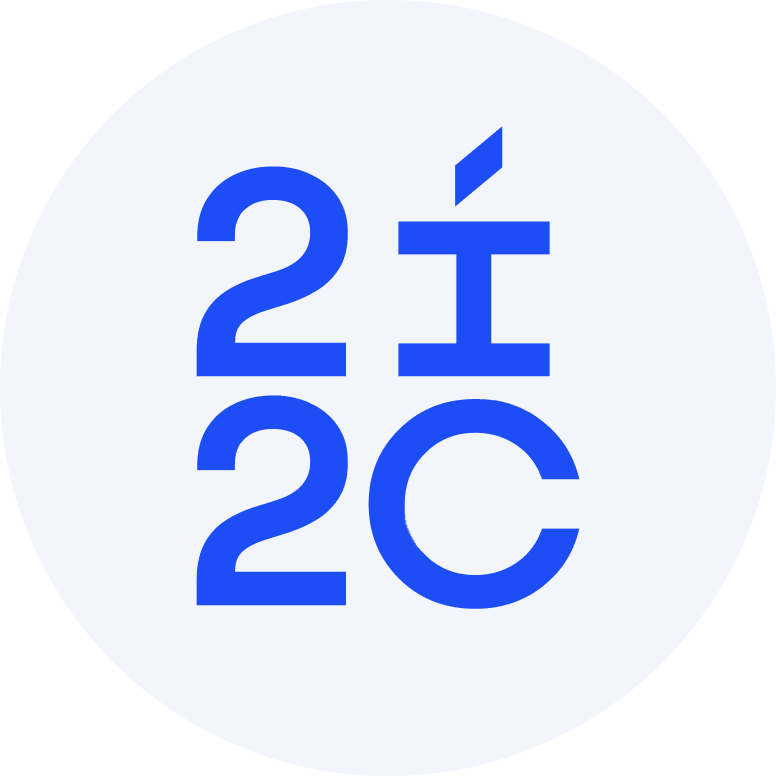
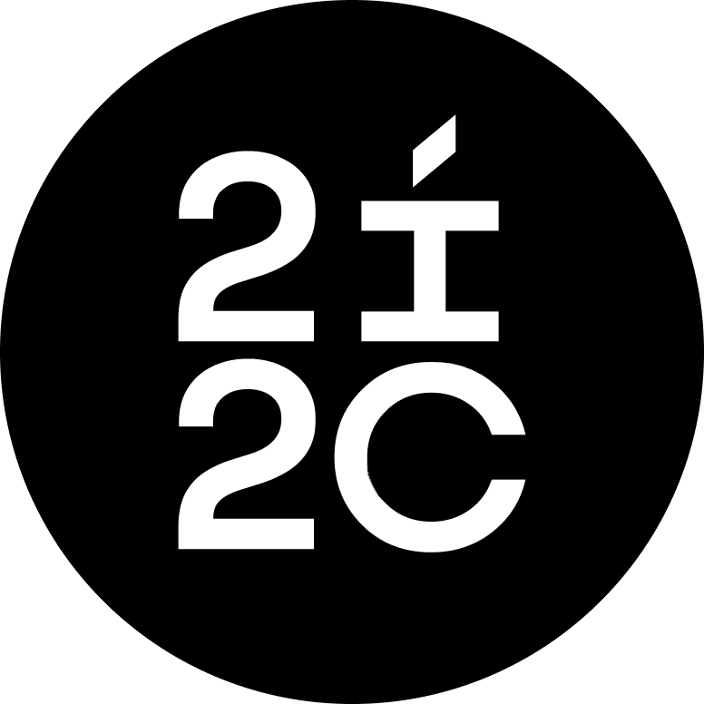

+++
reading_time = false  # Show estimated reading time?
share = false  # Show social sharing links?
profile = false  # Show author profile?
comments = false  # Show comments?
title = "Design and brand guidelines"
banner.image = false
+++

## Brand guidelines

Our [Brand Guidelines document](https://docs.google.com/presentation/d/1O36_yjTSKiXB9_yAnj4QnF_sob1z_GQmcfIVrZ_ymeY/edit?usp=drive_link) describes 2i2c's overall brand and visual style.

## Logos

### Square logo (default)

**Logo**

[Download SVG](logo.svg) | [Download PDF](logo.pdf)

**Logo light**

**Logo black**

### Wide logos

**Wide logo**

[Download SVG](logo-wide.svg) | [Download PDF](logo-wide.pdf)

**Wide logo light**

## Colors

### Primary colors

- Big Blue: `#1D4EF5`
- Pale Blue: `#F2F5FC`
- Black: `#000000`

### Secondary colors

- Midnight: `#230344`
- Mauve: `#B86BFC`

- Forest: `#057761`
- Light Green: `#0CEFAE`

- Magenta: `#C60A76`
- Pink: `#FF808B`

- Coral: `#FF4E4F`
- Yellow: `#FFDE17`

## Design assets

_These two links are only accessible to 2i2c team members._

[Figma canvas with design assets](https://www.figma.com/file/pp9e4cNYthJnm8u6MzpUdp/Logo-and-brand-assets?type=design&node-id=0%3A1&mode=design&t=Rtl3KwVFv63I4sj9-1)

[Google Drive folder with design assets](https://drive.google.com/drive/folders/1YMb1nEW-tX8DaNPzKx5IOJ747BPQDDDe?usp=drive_link)

