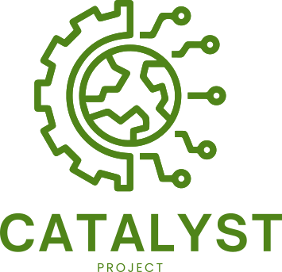

[The Catalyst Project](https://catalystproject.cloud/) is a collaborative initiative focused on advancing scientific computing and cloud infrastructure for research communities. They work to accelerate the adoption of cloud-native scientific computing tools and practices.

## Grants funding this project

- A $1.5M award from [CZI](../czi/) funded this project ([Zenodo entry](https://zenodo.org/records/7025288)).
