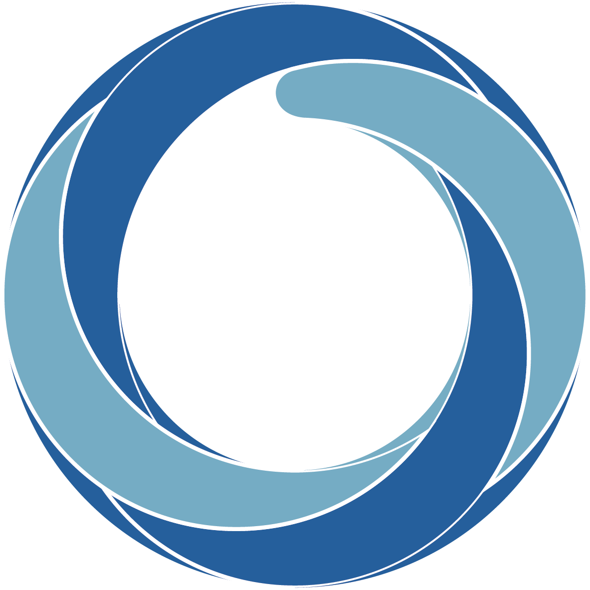

[CIROH](https://ciroh.ua.edu/) (Cooperative Institute for Research to Operations in Hydrology) is a NOAA-funded institute hosted by the [Alabama Water Institute](https://awi.ua.edu/) at the University of Alabama. CIROH advances national water prediction capabilities through research and technology transfer. 2i2c operates JupyterHub infrastructure for the CIROH community, supporting hydrological research and training across their consortium of partner institutions.
