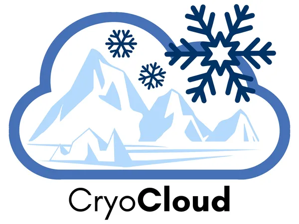

[CryoCloud](https://cryointhecloud.com/) is a collaborative cloud platform designed to accelerate discovery and enhance collaboration for NASA Cryosphere communities. CryoCloud provides cloud-based computational tools, shared resources, and educational materials to support researchers studying ice-related environments and climate systems.