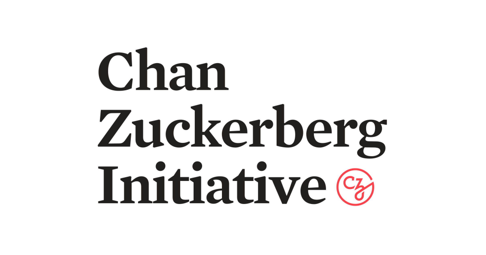

The [Chan Zuckerberg Initiative](https://chanzuckerberg.com/) is a philanthropic organization that supports open source software development and scientific research to advance human health and education.

BlueSky: [@cziscience.bsky.social](https://bsky.app/profile/cziscience.bsky.social)

## Grants from this funder

- **Core Support (2021)**: [2i2c receives core support from CZI](../../blog/czi-core-support/) - ~$1.4M over three years to establish 2i2c's foundational operations
- **Extended Support (2024)**: [Support from CZI to sustain 2i2c's mission](../../blog/funding-czi/) - ~$700K over one year for continued operations  
- **CZI Global Communities Grant (2022)**: [New project: Open science cloud infrastructure and training for communities in Latin America and Africa](../../blog/czi-global-communities-announcement/) - Support for international collaborative programs