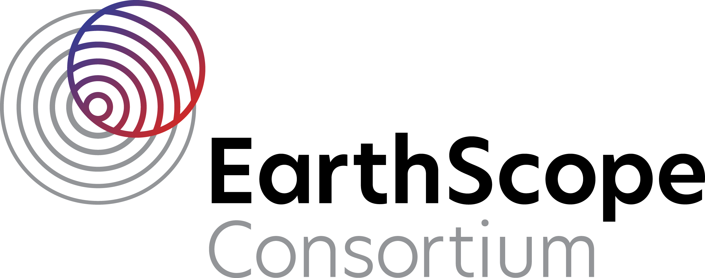

[EarthScope Consortium](https://www.earthscope.org/) is a university-based organization that supports transformative global geophysical research and education. They operate NSF's GAGE and SAGE Facilities, providing geophysical instrumentation support, data services, and educational resources to the scientific community.