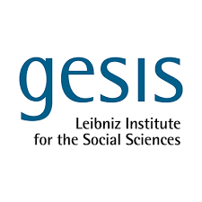

[GESIS - Leibniz Institute for the Social Sciences](https://www.gesis.org/) is a research infrastructure organization that provides data, tools, and services for the social sciences. They also work with [CESSDA](https://www.cessda.eu).

## Grants that fund this collaboration

- In cooperation with NFDI4DS, (project number: [460234259](https://gepris.dfg.de/gepris/projekt/460234259?context=projekt&task=showDetail&id=460234259&))
