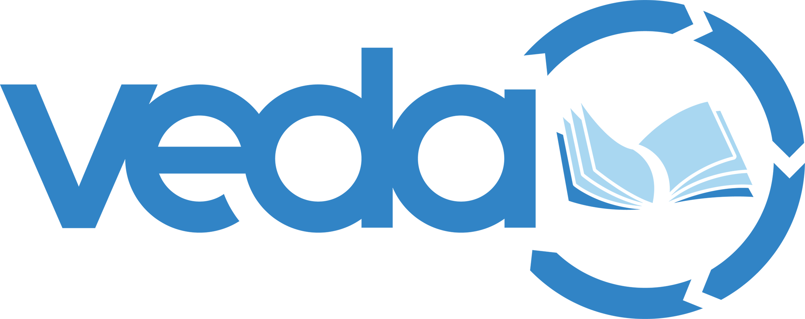
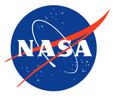

[NASA VEDA](https://www.earthdata.nasa.gov/dashboard/) (Visualization, Exploration, and Data Analysis) is NASA's open-source, cloud-native platform for Earth science data.
It makes NASA's Earth observation data more accessible and usable for researchers, policymakers, and the public, and demonstrates the benefits of cloud-native data for open science.

VEDA is a project of the Data Systems Evolution (DSE) team at NASA Marshall Space Flight Center's [Office of Data Science and Informatics (ODSI)](https://www.nasa.gov/marshall/marshall-space-flight-missions/office-of-data-science-and-informatics-odsi/), developed in partnership with [Development Seed](../devseed/).
ODSI enables scientific exploration and discovery through innovative data visualization techniques and analysis capabilities that lower the barrier to entry for cloud-hosted data.

The platform has several major components:

- **Dashboard**: browse, visualize, and explore Earth science datasets and data stories in the browser.
- **Analytics Platform**: a JupyterHub environment for deeper, more complex analysis. (_this is where 2i2c spends much of our time on the project_)
- **Data Services**: analysis-ready, cloud-optimized data published through a SpatioTemporal Asset Catalog (STAC).

2i2c provides the interactive computing infrastructure behind the VEDA Analytics Platform, enabling users to explore and analyze NASA's vast Earth science datasets through JupyterHub environments in the cloud.

_Check out the [DevSeed NASA VEDA project page](https://developmentseed.org/projects/nasa-odsi-veda/) for more information about VEDA._
