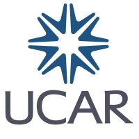

The [University Corporation for Atmospheric Research (UCAR)](https://www.ucar.edu/) is a nonprofit consortium of colleges and universities that manages the National Center for Atmospheric Research and supports atmospheric science research.